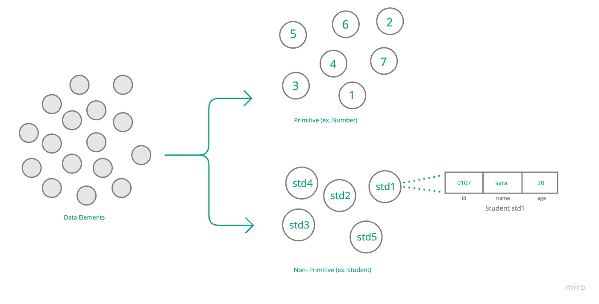
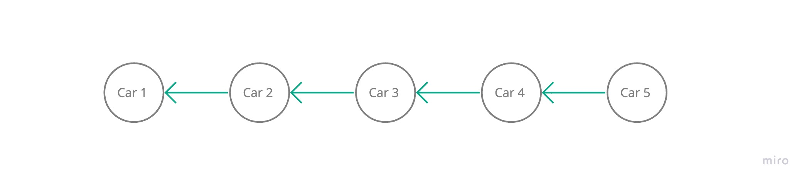
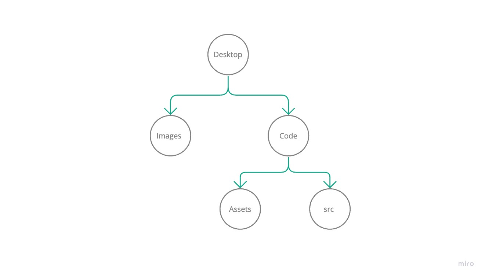
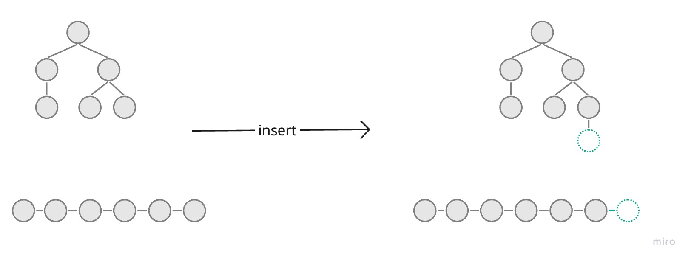

# Introduction to Data Structures and Algorithms

## Concept
`Data Structure` is a way of organizing, storing, and manipulating data. 

This definition is what most of us read about and know, and it is correct. Data structures help us organize data and manipulate it easily. But here we will take each keyword in the definition individually and explain it.


### Data
The first part we want to focus on is `data`, which is the raw data that we want to organize and manipulate. It is the main input for our data structures (organizations) so we will start from it. 

From the start, data structures help us organize the data we have into an organized set. Let's imagine we have a collection of toys, if the toys are not organized then finding a specific toy will be hard and time-consuming. But, if we organized these toys in a more accessible way such as putting each type of toy in a box (ex. dolls, cars, balls...) then finding a doll will be easy since it will be in the doll's box.

#### Data types
Data in our programs could be categorized as
-  `primitive`, the basic types including integers, doubles, booleans, and characters.
-  `non-primitive` or we can call it `compost`, which is a more complex type that composes more than one primitive type such as objects.

Following the same example above, if we have an unorganized collection of data such as integers, then it will be hard for us to search or access a specific number. But, if we organize these integers using an `Array` as an example, then it is going to be easy to access, search, and modify.



### Organize
Organizing data could be done using multiple ways. If we return to the toys example in the data section, we can come up with multiple ways to organize the toys, we can organize them as boxes by category color, or even sizes. We can also store it by using its original boxes and stack them over each other and so on. 

These are just a few examples of organizing the toys. And depending on your type of organization accessing or searching for a toy could be easier or harder.

#### Organization and Data Structure
Organization is Data Structure. When we want to organize toys, plates, or books we will be structuring it in a specific way called organization aka "structure". 

So, if we want to make accessing, searching, and handling some data in a program easier then we will organize it using one of the organization's types (data structures). These organizations could be array, stack, queue, or any other way of organizing your data.


#### Organization Components
Most organizations consist of two main components, these components if used differently will form a specific type of organization (data structure). These components are  `Node` and `Pointer`.


<details>
  <summary> Node </summary>

We can think of a node as the main container of our data (whether it is primitive or non-primitive).

> It is described in the images as a circle containing data.

</details>


<details>
  <summary> Pointer </summary>

A pointer or what might be called a reference, is a link used to point to another node. 

To demonstrate the idea, let's imagine you are in a long car line at a food truck drive-through. Could you tell whose car is currently served? mostly you can not tell if the line is straight, you only know who is in front of you. And that means you can know and `point` to the car in front of you.

> Note: cars in the line can be served randomly since some orders are faster than others.




The car example above is similar to the `linked-list` data structure. If we manipulate the structure by having multiple pointers for each node we will form a `tree` data structure.




The concept of pointers is crucial, and as you saw we can form different organizations if used differently. This means when we  explain organizations later on we will mostly focus on storing data and manipulating pointers.


> Each node can have single or multiple pointers.

> Pointers are normally stored as part of the node.

</details>


### Manipulate 
Manipulating means performing some actions or operations on data. So when we organize toys we can perform some actions like searching, taking, and storing a toy.

> Performing actions on data such as searching for a toy could be done even without organization, but it will be hard to do and a real time-consuming process. So, organizing data helps us manage data and handle it much more easily and faster.

#### Manipulation and Algorithms
Manipulations mean writing an operation aka "Algorithm". So, when we write an insert operation to store data on an organization then we are writing an algorithm. 

In other words, manipulation in the data structure definitions means writing algorithms to perform some actions on the data.



Algorithms performed on data structures are mostly applied to any type of organization. For example, the fetching, inserting, and removing processes could be done on your toys, clothes, or books. But there are some cases when you perform some actions on a specific type of organization, books for example could be read but toys can not be read but could be played with.
That being said, we can categorize algorithms into two types, common algorithms that are applied to any type of organization. And specific organization's algorithms that apply to specific types of organization. 


## Conclusion

In conclusion, Data structures are just organization types to use for organizing data, while algorithms are the operations we perform on these organizations and their data.

 ### Next Step
We will focus later on, on explaining each organization, its attributes, and algorithms. Then we will cover the common shared operations that are applied to these organizations such as sorting and searching.

## Projects
1. Having a list of weekdays as a string, visualize the data as an array using [array visualizer](https://array-3d-viz.vercel.app/).

```
[ "Sunday", "Monday", "Tuesday", "Wednesday", "Thursday", "Friday" ]
```

> Note: for submission, create an issue called "array visualization submission - \<your-github-username\>" 
