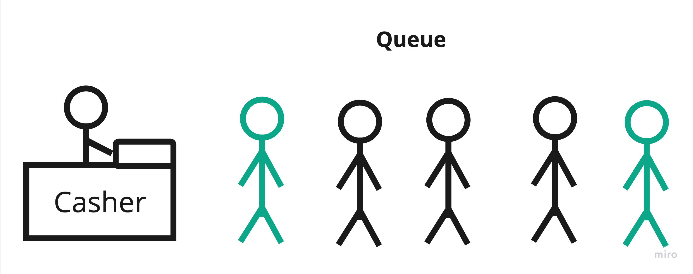
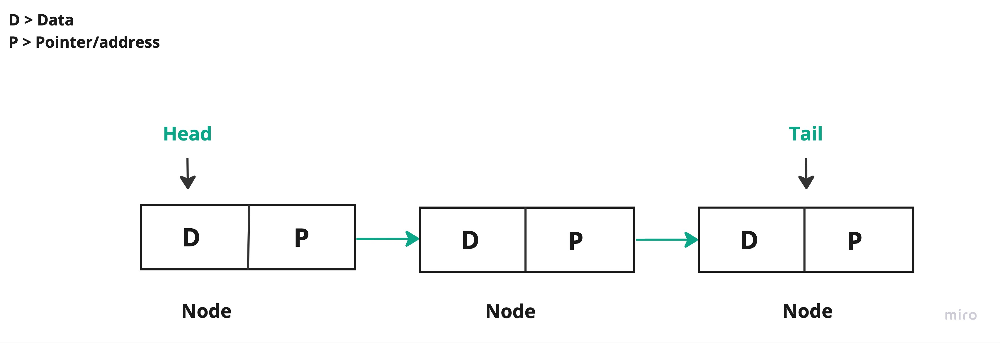
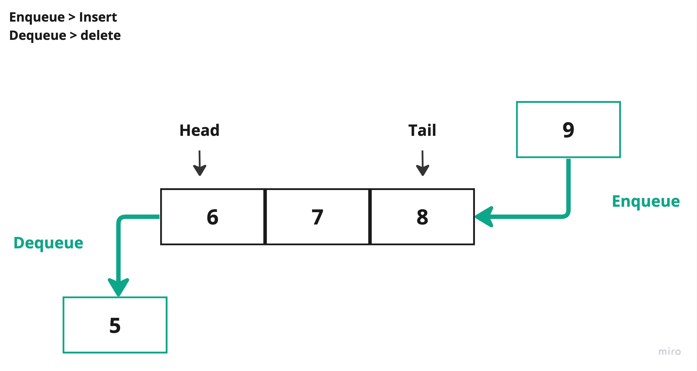

# Queue

Have you ever been in a line? we usually form a line whenever we want to be served whether it's at a coffee shop, or a bank, when we form a line the serving process will be much easier and controllable Each new customer who comes in will join the last of the line, and the first customer in the line will be served first, after a customer gets served, they leave the line.



We use the same concept in the data structure to organize the data in programs, it's called a `queue`, which has the same concept as what we described earlier.

> Queue is another word to describe a line.

## Concept

`Queue` is a **linear data structure**. `queue` are organized in a line/queue. The first element in the `queue` is called`head`. The end of the element in the `queue`is called the`tail`.



> Some resources refer to the first element in the queue as [head, front],
>
> and for the end of the element they refer to it as [rear, tail, end]

**Queue Operation**

Every new element will be added at the end of the `queue`. The first element in the line will be processed first, once the element is processed it will be removed from the queue.



**Enqueue**: add an element at the end of the queue.

**Dequeue**: return the last element from the queue and remove it from the queue.

> Each programming language has different names for enqueue and dequeue operations.
>
> * enqueue = push / addFirst / insert.
> * dequeue = pop / removeLast /delete.

**Why do we use a queue?**

To ensure that elements are processed in the order in which they were added, making it possible to manage tasks or requests in a systematic and predictable manner.

> To implement a queue, you can use an `array` or a `linked list`.

**Types of queue:**

* **Linear Queue**: A linear `queue` is the most basic form of a `queue`, where elements are stored in a linear manner.
* **Deque (Double-Ended Queue)**: It allows insertion and removal of elements from both ends.
* **Circular Queue**: It arranges the data in a circular order where the rear end is connected with the front end.
* **Priority Queue**: Elements with higher priority are dequeued before elements with lower priority. If elements with the same priority occur, they are served according to their order in the queue.

## Implementation

### Queue Array

1. Declare the `queue array`, by creating a class, with the following attributes.
   ```java
   class QueueArray {
       int array[];
       int front;
       int rear;
       int size;

       public QueueArray(int size) {
           array = new int[size];
           front = -1;
           rear = -1;
           this.size = size;
       }


       public static void main(String[] args) {


       }
   }
   ```

> We have declared the `front` and `rear` attributes to easily do the operations.

2. Create an object from `DequeArray` and insert an element.

   ```java
   public static void main(String[] args) {

           QueueArray queue = new QueueArray(4);
           queue.front++;
           queue.rear++;
           queue.array[rear] = 1;

   }
   ```
3. Update the element value.

```java
queue.array[rear] = 50;
```


> Now we have created an element in the `queue`

4. To make the insertion and deletion easy, we declare a methods `enqueue` and `dequeue`.
   **`enqueue` method:**

```java
void enqueue(int item) {
        if ((front == 0 && rear == size - 1) || front == rear + 1) {
            System.out.println("Overflow");
            return;
        }

        if (front == -1) {
            front = 0;
            rear = 0;
        }

        else if (front == 0)
            front = size - 1;

        else
            front = front - 1;

        array[front] = item;
    }

    public static void main(String[] args) {

        QueueArray queue = new QueueArray(2);
        queue.enqueue(10);

    }
```

**`dequeue` method**:

```java
int dequeue() {
        if (front == -1) {
            System.out.println("Underflow");
            return -1;
        }

        int item = array[front];

        if (front == rear) {
            front = -1;
            rear = -1;
        }

        else if (front == size - 1)
            front = 0;

        else
            front = front + 1;

        return item;
    }

    public static void main(String[] args) {

        QueueArray queue = new QueueArray(2);
        queue.enqueue(10);
        System.out.println(queue.dequeue());

    }
```

## Example

another way to use queue is by using the built-in classes.

> Some programming language doesn't have built-in class to support queue.

### Primitive

#### Java

````Java
import java.util.LinkedList;
import java.util.Queue;

public class Main {
    public static void main(String[] args) {

        Queue queue = new LinkedList();

        // Enqueue: add to the end of the queue.
        queue.add(10);
        queue.add(20);

        // Dequeue: return the first element of the queue, and remove it.
        System.out.println(queue.remove());

        // Peek: return the first element of the queue, but don't remove it.
        System.out.println(queue.peek());

    }
}
````

**OUTPUT**

````
10
20
````

#### C++

````cpp
#include <iostream>
#include <queue>

int main() {
  std::queue<int> myQueue;

  // Enqueue: add to the end of the queue.
  myQueue.push(10);
  myQueue.push(20);

  // Peek: return the first element of the queue, but don't remove it
  std::cout << myQueue.front() << std::endl;

  // Dequeue: return the first element of the queue, and remove it.
  myQueue.pop();


  // Peek: return the first element of the queue, but don't remove it
  std::cout << myQueue.front() << std::endl;

  return 0;
}
````

**OUTPUT**

````
10
20
````

### Non-Prmitive

#### Java

````Java
import java.util.LinkedList;
import java.util.Queue;

import static java.lang.System.in;

class MyData {
    int id;

    MyData(int i) {
        id = i;
    }
}

public class Main {
    public static void main(String[] args) {

        Queue<MyData> queue = new LinkedList<>();

        // Enqueue: add to the end of the queue.
        queue.add(new MyData(10));
        queue.add(new MyData(20));

        // Dequeue: return the first element of the queue, and remove it.
        System.out.println(queue.remove().id);

        for (MyData data : queue) {
            System.out.println(data.id);
        }
    }
}
````

#### C++

````cpp
#include <iostream>
#include <queue>

class MyData {
public:
    int id;

    MyData(int i) : id(i) {}
};

int main() {
 std::queue<MyData> myQueue;

 // Enqueue: add to the end of the queue.
 myQueue.push(MyData(10));
 myQueue.push(MyData(20));

 // Peek: return the first element of the queue, but don't remove it
 std::cout << myQueue.front().id << std::endl;

 // Dequeue: return the first element of the queue, and remove it.
 myQueue.pop();

 // Peek: return the first element of the queue, but don't remove it
 std::cout << myQueue.front().id << std::endl;

 return 0;
}
````

## Projects


| Project ID          | Project Title  | Deadline |
| ------------------- | -------------- | -------- |
| DSAProject01Queue01 | Linear Queue   |          |
| DSAProject01Queue02 | Circular Queue |          |
| DSAProject01Queue03 | Deque          |          |
| DSAProject01Queue04 | Priority Queue |          |
