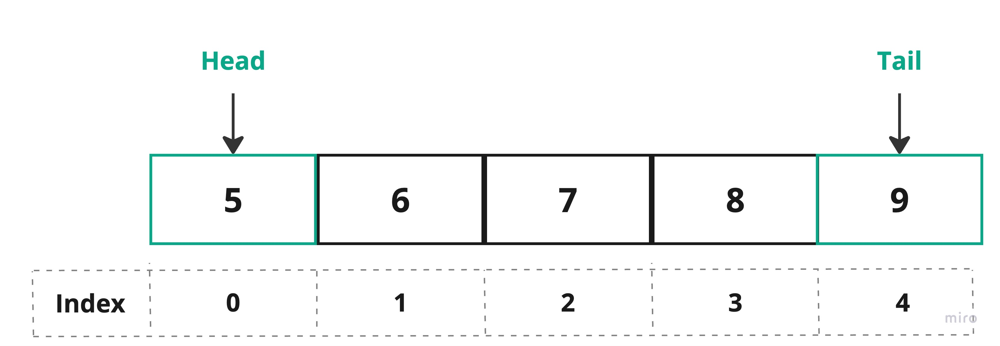

# Queue

Have you ever been in a line? we usually form a line whenever we want to be served whether it's at a coffee shop, or a bank. When we form a line the serving process will be much easier and controllable. Each new customer who comes in will join the last of the line, and the first customer in the line will be served first, after a customer gets served, they leave the line.


We use the same concept in the data structure to organize the data in programs, it's called a `queue`, which has the same concept as what we described earlier.

> Queue is another word to describe a line.

## Concept

Queue is a **linear data structure**.  The first element in the `queue` is called`head`. The end of the element in the `queue`is called the`tail`.

> To implement a queue, you can use an `array` or a `linked list`.

**Queue Array**



**Queue Linked-list**


> Some resources refer to the first element in the queue as [head, front],
> 
> and for the end of the element they refer to it as [rear, tail, end]

**Queue Operation**

Every new element will be added at the end of the queue. The first element in the line will be processed first, once the element is processed it will be removed from the queue.


**Enqueue**: add an element at the end of the queue.

**Dequeue**: return the last element from the queue and remove it from the queue.

> Each programming language has different names for enqueue and dequeue operations.
> 
> * enqueue = push / addFirst / insert.
> * dequeue = pop / removeLast /delete.

**Why do we use a queue?**

To ensure that elements are processed in the order in which they were added, making it possible to manage tasks or requests in a systematic and predictable manner.

## Implementation

In this section we will impelment the queue using `array`.

### Queue Array

1. Declare **QueueArray** class, by creating a class, with the following **attributes**.
   
   ```java
   class QueueArray {
       int array[];
       int front;
       int rear;
       int size;
   }
   ```


2. Create a **constructor** to **declare an array**, and assign **default value -1** for **front** and **rear** when an object created. The constructor parameter, we pass the size, which it will be the size/length of the **Array**.

```java
class QueueArray {
    int array[];
    int front;
    int rear;
    int size;
    // constructor
    public QueueArray(int size) {
        array = new int[size];
        front = -1;
        rear = -1;
        this.size = size;
    }

}
```

> We have declared the `front` and `rear`, to easily do the operations **enqueue** and **dequeue**.

2. Create an object from `QueueArray` class and insert an element.
   
   ```java
   public static void main(String[] args) {
   
           QueueArray queue = new QueueArray(4);
           queue.front++;
           queue.rear++;
           queue.array[rear] = 1;
   
   }
   ```
   
   Every time we have add an element, we increase the rear by one [**queue.rear++**].
   
   When inserting the first element the value of front will be **0**, and it will be **-1** if the queue is empty.
3. Update the element value.

```java
queue.array[rear] = 50;
```


> Now we have created an element in the `queue`

4. In the QueueArray class, create a method that check if the queue is empty.
   
   ```java
   boolean isEmpty() {
           return front == -1;
       }
   ```
5. Create a method that check if the queue if full.
   
   ```java
   boolean isFull() {
           return (front == 0 && rear == size - 1);
       }
   ```
   
   In the image below the queue array is full. We know that the tail is the index of the last element, so if the tail = size -1 will be true, which mean the array is full.


6. To make the insertion and deletion process easy, we declare a methods `enqueue` and `dequeue`.

```java
void enqueue(int item) {
        // check if the queue is full or not
        if (isFull()) {
            System.out.println("Overflow");
            return;
        }

        // if the queue is empty then set front and rear to 0
        if (front == -1) {
            front = 0;
            rear = 0;
        }
        // if the queue is not empty then rear will be increment by 1
        else {
            rear++;

        }
        // insert the item at the rear
        array[rear] = item;
    }
```

The above code. We create a enqueue method, which insert a new element at rear. Let's break the code line by line.

First the method take an argument of type integer that will store the value into the queue, then we have if statement to change the front and rear value depend on the queue status. Finally we will insert an element at the rear.

**`dequeue` method**:

```java
void dequeue(){
        if(isEmpty()){
            System.out.println("Queue is empty. Nothing to dequeue");
            // if the queue has only one element then set front and rear to -1
        } else if (front == rear){
            front = rear = -1;
            // if the queue has more than one element then increment front by 1
        } else {
            front++;
        }
    }
```

In the code above. We have created a dequeue method that increment the **front by one**, and if the queue has only one element then the front and rear will be **-1**.

So far we have created the following methods [isFull(), isEmpty, enqueue(), dequeue()] in the QueueArray class.

Let's create an object from **QueueArray** class, and call the methods that we have created in the **main method.**

```java
class Main {
    public static void main(String[] args) {
        QueueArray queue = new QueueArray(4);

        queue.enqueue(10);
        queue.enqueue(20);
        queue.enqueue(30);
        queue.dequeue();
        queue.enqueue(40);

        System.out.println(queue.front);
        System.out.println(queue.rear);
    }
}
```

In the main method. We have created a queue array that has the following values.


**OUTPUT**

````
FRONT: 1
REAR: 3
````

## Types of queue

* **Linear Queue**: A linear `queue` is the most basic form of a `queue`, where elements are stored in a linear manner.
* **Deque (Double-Ended Queue)**: It allows insertion and removal of elements from both ends.
* **Circular Queue**: It arranges the data in a circular order where the rear end is connected with the front end.
* **Priority Queue**: Elements with higher priority are dequeued before elements with lower priority. If elements with the same priority occur, they are served according to their order in the queue.

## Example

another way to use queue is by using the built-in classes.

> Some programming language doesn't have built-in class to support queue.

### Primitive

#### Java

````Java
import java.util.LinkedList;
import java.util.Queue;

public class Main {
    public static void main(String[] args) {

        Queue queue = new LinkedList();

        // Enqueue: add to the end of the queue.
        queue.add(10);
        queue.add(20);

        // Dequeue: return the first element of the queue, and remove it.
        System.out.println(queue.remove());

        // Peek: return the first element of the queue, but don't remove it.
        System.out.println(queue.peek());

    }
}
````

**OUTPUT**

````
10
20
````

#### C++

````cpp
#include <iostream>
#include <queue>

int main() {
  std::queue<int> myQueue;

  // Enqueue: add to the end of the queue.
  myQueue.push(10);
  myQueue.push(20);

  // Peek: return the first element of the queue, but don't remove it
  std::cout << myQueue.front() << std::endl;

  // Dequeue: return the first element of the queue, and remove it.
  myQueue.pop();


  // Peek: return the first element of the queue, but don't remove it
  std::cout << myQueue.front() << std::endl;

  return 0;
}
````

**OUTPUT**

````
10
20
````

### Non-Prmitive

#### Java

````Java
import java.util.LinkedList;
import java.util.Queue;

import static java.lang.System.in;

class MyData {
    int id;

    MyData(int i) {
        id = i;
    }
}

public class Main {
    public static void main(String[] args) {

        Queue<MyData> queue = new LinkedList<>();

        // Enqueue: add to the end of the queue.
        queue.add(new MyData(10));
        queue.add(new MyData(20));

        // Dequeue: return the first element of the queue, and remove it.
        System.out.println(queue.remove().id);

        for (MyData data : queue) {
            System.out.println(data.id);
        }
    }
}
````

#### C++

````cpp
#include <iostream>
#include <queue>

class MyData {
public:
    int id;

    MyData(int i) : id(i) {}
};

int main() {
 std::queue<MyData> myQueue;

 // Enqueue: add to the end of the queue.
 myQueue.push(MyData(10));
 myQueue.push(MyData(20));

 // Peek: return the first element of the queue, but don't remove it
 std::cout << myQueue.front().id << std::endl;

 // Dequeue: return the first element of the queue, and remove it.
 myQueue.pop();

 // Peek: return the first element of the queue, but don't remove it
 std::cout << myQueue.front().id << std::endl;

 return 0;
}
````

## Projects

| Project ID          | Project Title  | Deadline |
| ------------------- | -------------- | -------- |
| DSAProject01Queue01 | Linear Queue   |          |
| DSAProject01Queue02 | Circular Queue |          |
| DSAProject01Queue03 | Deque          |          |
| DSAProject01Queue04 | Priority Queue |          |
