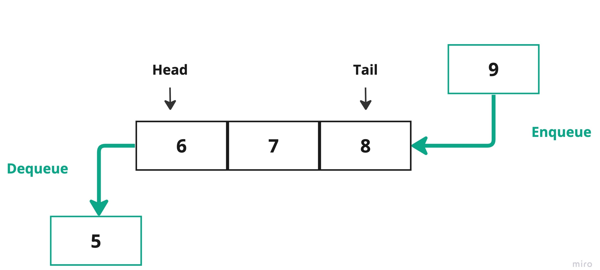

# Linear Queue

## Concept

A **linear queue**, also known as a **simple queue** is a type of `queue` data structure, where the elements are stored in a linear or sequential manner. The first element is called `head`, and the last element of the queue is called `tail`.

The primary operations of the queue are:

* **Enqueue**: The insertion of a node at the end of the queue, which is at the `rear`/`tail`.
* **Dequeue**: The deletion of a node occuers at the start of the queue, which is at the `head`/`front`.



## Example

We can use either `Linked list` or `Array` to create a `queue` data structure.

### Primitive 

- In Java programming language:  

````Java
public class QueueArray {
    final int SIZE = 5;

    int items[] = new int[SIZE];

    int front, rear;

    QueueArray() {
        front = -1;
        rear = -1;
    }

    public boolean isFull(){
        if(front == 0 && rear == SIZE - 1){
            return true;
        }
        return false;
    }

    public boolean isEmpty(){
        if(front == -1) {
            return true;
        }
        else {
            return false;
        }
    }

    public void enQueue(int element) {
        if(isFull()) {
            System.out.println("QueueLinkedList.Queue is full");
            return;
        }
        // if the queue is empty
        if(front == -1) {
            front = 0;
        }

        rear++;
        items[rear] = element;

    }

    public int deQueue() {
        int element;

        if(isEmpty()){
            System.out.println("QueueLinkedList.Queue is empty");
            return (-1);
        }
        else {

            element = items[front];

            if(front >= rear){
                front = -1;
                rear = -1;
            }
            else {
                front++;
            }
            System.out.println( element + " Deleted");
            return (element);
        }
    }

    public void display() {
        int i;
        if(isEmpty()) {
            System.out.println("Queue is empty!");
        }
        else {
            for(i = front; i <= rear; i++)
                System.out.println("Item -> " + items[i] + "  ");
        }
    }

    public static void main(String[] args) {
        QueueArray queueArray = new QueueArray();

        queueArray.enQueue(1);
        queueArray.enQueue(2);
        queueArray.enQueue(3);

        queueArray.display();

        queueArray.deQueue();

        queueArray.display();

    }
}

````

- In C++ Programming language:

```C++
#include <iostream>

class QueueArray {
    static const int SIZE = 5;
    int items[SIZE];
    int front, rear;

public:
    QueueArray() {
        front = -1;
        rear = -1;
    }

    bool isFull() {
        if (front == 0 && rear == SIZE - 1) {
            return true;
        }
        return false;
    }

    bool isEmpty() {
        if (front == -1) {
            return true;
        } else {
            return false;
        }
    }

    void enQueue(int element) {
        if (isFull()) {
            std::cout << "Queue is full" << std::endl;
            return;
        }
        // if the queue is empty
        if (front == -1) {
            front = 0;
        }

        rear++;
        items[rear] = element;
    }

    int deQueue() {
        int element;

        if (isEmpty()) {
            std::cout << "Queue is empty" << std::endl;
            return (-1);
        } else {
            element = items[front];

            if (front >= rear) {
                front = -1;
                rear = -1;
            } else {
                front++;
            }

            std::cout << element << " Deleted" << std::endl;
            return (element);
        }
    }

    void display() {
        if (isEmpty()) {
            std::cout << "Queue is empty!" << std::endl;
        } else {
            for (int i = front; i <= rear; i++) {
                std::cout << "Item -> " << items[i] << std::endl;
            }
        }
    }
};

int main() {
    QueueArray queueArray;

    queueArray.enQueue(1);
    queueArray.enQueue(2);
    queueArray.enQueue(3);

    queueArray.display();

    queueArray.deQueue();

    queueArray.display();

    return 0;
}
```

### Non-primitive

- In Java programming language: 

````Java
import java.util.Arrays;

public class QueueArray {
    final int SIZE = 5;

    String items[] = new String[SIZE];

    int front, rear;

    QueueArray() {
        front = -1;
        rear = -1;
    }

    public boolean isFull(){
        if(front == 0 && rear == SIZE - 1){
            return true;
        }
        return false;
    }

    public boolean isEmpty(){
        if(front == -1) {
            return true;
        }
        else {
            return false;
        }
    }

    public void enQueue(String element) {
        if(isFull()) {
            System.out.println("QueueLinkedList.Queue is full");
            return;
        }
        // if the queue is empty
        if(front == -1) {
            front = 0;
        }

        rear++;
        items[rear] = element;

    }

    public String deQueue() {
        String element;

        if(isEmpty()){
            System.out.println("QueueLinkedList.Queue is empty");
            return null;
        }
        else {

            element = items[front];

            if(front >= rear){
                front = -1;
                rear = -1;
            }
            else {
                front++;
            }
            System.out.println( element + " Deleted");
            return (element);
        }
    }

    public void display() {
        int i;
        if(isEmpty()) {
            System.out.println("Queue is empty!");
        }
        else {
            for(i = front; i <= rear; i++)
                System.out.println("Item -> " + items[i] + " ");
        }
    }

    public static void main(String[] args) {
        QueueArray queueArray = new QueueArray();

        queueArray.enQueue("A");
        queueArray.enQueue("B");
        queueArray.enQueue("C");

        queueArray.display();

        queueArray.deQueue();

        queueArray.display();

    }
}
````

- In C++ Programming language:

```C++
#include <iostream>
#include <string>

class QueueArray {
    static const int SIZE = 5;
    std::string items[SIZE];
    int front, rear;

public:
    QueueArray() {
        front = -1;
        rear = -1;
    }

    bool isFull() {
        if (front == 0 && rear == SIZE - 1) {
            return true;
        }
        return false;
    }

    bool isEmpty() {
        if (front == -1) {
            return true;
        } else {
            return false;
        }
    }

    void enQueue(std::string element) {
        if (isFull()) {
            std::cout << "Queue is full" << std::endl;
            return;
        }
        // if the queue is empty
        if (front == -1) {
            front = 0;
        }

        rear++;
        items[rear] = element;
    }

    std::string deQueue() {
        std::string element;

        if (isEmpty()) {
            std::cout << "Queue is empty" << std::endl;
            return "";
        } else {
            element = items[front];

            if (front >= rear) {
                front = -1;
                rear = -1;
            } else {
                front++;
            }

            std::cout << element << " Deleted" << std::endl;
            return element;
        }
    }

    void display() {
        if (isEmpty()) {
            std::cout << "Queue is empty!" << std::endl;
        } else {
            for (int i = front; i <= rear; i++) {
                std::cout << "Item -> " << items[i] << std::endl;
            }
        }
    }
};

int main() {
    QueueArray queueArray;

    queueArray.enQueue("A");
    queueArray.enQueue("B");
    queueArray.enQueue("C");

    queueArray.display();

    queueArray.deQueue();

    queueArray.display();

    return 0;
}
```

## Projects


| Project ID   | Project Title     | Deadline |
| ------------ | ----------------- | -------- |
| DSAProject01 | [Linear Queue]() |          |
