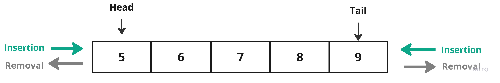

# Deque

## Concept

**Deque** or **double ended queue** is type of `queue` data structure. The `deque` can insert and delete from both ends, at the start of the `queue` and at the end of the `queue`.



> To implement a queue, you can use an `array` or a `linked list`.

Operations of the deque are:

> * addFirst: add an element at the begining of the queue.
> * addLast: add an element at the end of the queue.
> * deleteFirst: remove the first element.
> * deleteLast: remove the last element.

## Example

#### Primitive

##### **Java**

````Java
class DequeArray {
    static final int MAX = 100;
    int arr[];
    int front;
    int rear;
    int size;

    public DequeArray(int size) {
        arr = new int[MAX];
        front = -1;
        rear = 0;
        this.size = size;
    }

    boolean isFull() {
        return ((front == 0 && rear == size - 1) || front == rear + 1);
    }

    boolean isEmpty() {
        return (front == -1);
    }

    void addFront(int key) {
        if (isFull()) {
            System.out.println("Overflow");
            return;
        }

        if (front == -1) {
            front = 0;
            rear = 0;
        }

        else if (front == 0)
            front = size - 1;

        else
            front = front - 1;

        arr[front] = key;
    }

    void addRear(int key) {
        if (isFull()) {
            System.out.println(" Overflow ");
            return;
        }

        if (front == -1) {
            front = 0;
            rear = 0;
        }

        else if (rear == size - 1)
            rear = 0;

        else
            rear = rear + 1;

        arr[rear] = key;
    }

    void deleteFront() {
        if (isEmpty()) {
            System.out.println("Queue Underflow\n");
            return;
        }

        // Deque has only one element
        if (front == rear) {
            front = -1;
            rear = -1;
        } else if (front == size - 1)
            front = 0;

        else
            front = front + 1;
    }

    void deleteRear() {
        if (isEmpty()) {
            System.out.println(" Underflow");
            return;
        }

        if (front == rear) {
            front = -1;
            rear = -1;
        } else if (rear == 0)
            rear = size - 1;
        else
            rear = rear - 1;
    }

    int getFront() {
        if (isEmpty()) {
            System.out.println(" Underflow");
            return -1;
        }
        return arr[front];
    }

    int getRear() {
        if (isEmpty() || rear < 0) {
            System.out.println(" Underflow\n");
            return -1;
        }
        return arr[rear];
    }

    public static void main(String[] args) {

        DequeArray deque = new DequeArray(4);

        deque.addFront(10);
        deque.addRear(15);
        deque.addFront(5);
        deque.addRear(20);

        System.out.println("Front: "+ deque.getFront());
        System.out.println("Rear: "+ deque.getRear());

    }
}
````

**OUTPUT**

```
Front: 5
Rear: 20
```

##### **C++**

```cpp
#include <iostream>
using namespace std;

#define MAX 4

class DequeArray {
private:
    int arr[MAX];
    int front;
    int rear;
    int size;

public:
    DequeArray(int size) {
        front = -1;
        rear = 0;
        this->size = size;
    }

    bool isFull() {
        return ((front == 0 && rear == size - 1) || front == rear + 1);
    }

    bool isEmpty() {
        return (front == -1);
    }

    void addFront(int key) {
        if (isFull()) {
            cout << "Overflow" << endl;
            return;
        }

        if (front == -1) {
            front = 0;
            rear = 0;
        }

        else if (front == 0)
            front = size - 1;

        else
            front = front - 1;

        arr[front] = key;
    }

    void addRear(int key) {
        if (isFull()) {
            cout << " Overflow " << endl;
            return;
        }

        if (front == -1) {
            front = 0;
            rear = 0;
        }

        else if (rear == size - 1)
            rear = 0;

        else
            rear = rear + 1;

        arr[rear] = key;
    }

    void deleteFront() {
        if (isEmpty()) {
            cout << "Queue Underflow\n" << endl;
            return;
        }

        // Deque has only one element
        if (front == rear) {
            front = -1;
            rear = -1;
        } else if (front == size - 1)
            front = 0;

        else
            front = front + 1;
    }

    void deleteRear() {
        if (isEmpty() || rear < 0) {
            cout << " Underflow" << endl;
            return;
        }

        if (front == rear) {
            front = -1;
            rear = -1;
        } else if (rear == 0)
            rear = size - 1;
        else
            rear = rear - 1;
    }

    int getFront() {
        if (isEmpty()) {
            cout << " Underflow" << endl;
            return -1;
        }
        return arr[front];
    }

    int getRear() {
        if (isEmpty() || rear < 0) {
            cout << " Underflow\n" << endl;
            return -1;
        }
        return arr[rear];
    }

  
};

int main() {
    DequeArray deque(4);

    deque.addFront(10);
    deque.addRear(15);
    deque.addFront(5);
    deque.addRear(20);

    cout << "Front: " << deque.getFront() << endl;
    cout << "Rear: " << deque.getRear() << endl;

    return 0;
}
```

**OUTPUT**

```
Front: 5
Rear: 20
```


## Projects


| Project ID   | Project Title     | Deadline |
| ------------ | ----------------- | -------- |
| DSAProject02 | [Deque]() |          |
