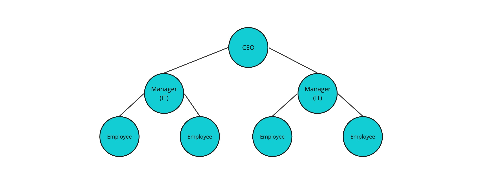
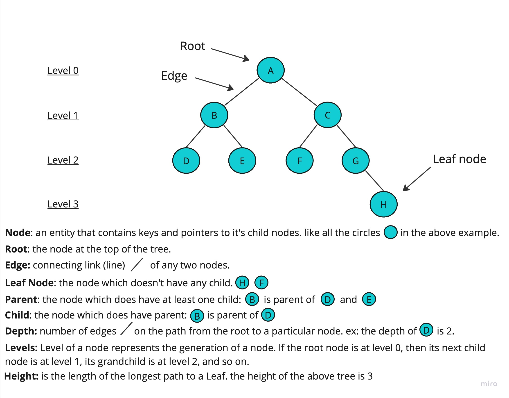
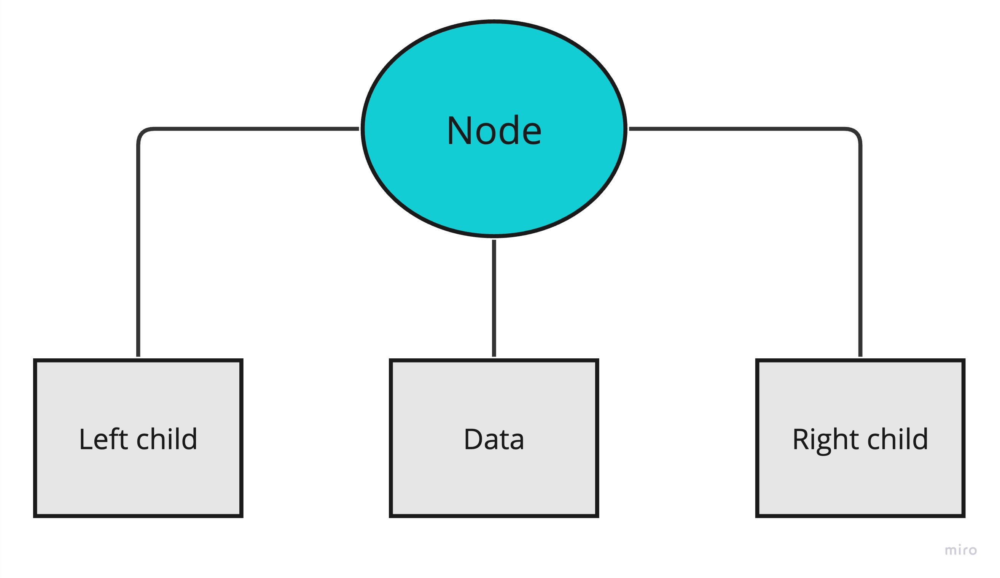
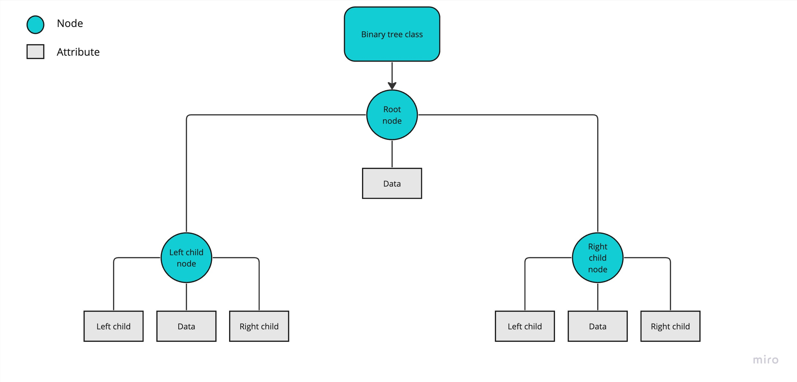

# Introduction to Tree

In data structure, tree is another way to organize the data.

When to use the tree and why?

Let's say you have a big company and your company have a large number of employees, the company have CEO, managers, directors.. How would you orgnanize the employees considering their roles/position?

Tree should be considered here, lets's see how the company employees would be organized using the tree as the below image (figuer 1):

Figure 1



## Concept

A tree is a collection of nodes that are connected by edges and has a hierarchical relationship between the nodes.

Figure 2


<details>

<summary>Types of tree</summary>
<br/>
1 - Binary tree

- A tree where the node has at most two child.

2 - Binary search tree (BST)

- A tree where the node at most has two child 
- A tree where the left subtree is less than the root
- A tree where the right subtree is bigger than the root

3 - AVL tree

- A self-balancing binary search tree
- Each node stores a value called a `balanced factor`, whose value is either -1, 0 or 1.
- `balanced factor` = (height of left subtree - height of right subtree) or (height of right subtree - height of left subtree)
- The tree in figure 2 is AVL tree.
- Example: The `balanced factor` for the node `A` = (height of left subtree {1} - height of right subtree {1}) = {0}.
  
4 - B-tree
- A special kind of self balancing tree, where the node can contain more than one key and can have more then two child.


</details>


<details>

<summary>Tree traversal</summary>
<br/>
The process of visiting required node to perform special operation or visiting each node and print their values.

There are three ways to travers tree:

1- Pre-order traversal

- Visit the root node
- Visit all nodes from the left side
- Visit all node from the right side
- Example: in figuer 2, the pre-order path is: `A -> B -> D -> E -> C -> F -> G -> H`.

2- In-order traversal

- Visit all nodes from the left side
- Visit the root node
- Visit all node from the right side
- Example: in figuer 2, the in-order path is: `D -> B -> E -> A -> F -> C -> G -> H`.


3- Post-order traversal

- Visit all nodes from the left side
- Visit all node from the right side
- Visit the root node
- Example: in figuer 2, the post-order path is: `D -> E -> B -> F -> H -> G -> C -> A`.

</details>


<details>

<summary>Tree structure</summary>
<br/>
Before digging into the expample let's see the two main classes in the tree. As we explained before the tree is a collection of nodes. 

the tree consist of `node` which holds the node information and data, and a `tree` which holds and connect all the nodes together.
`Node` and `tree` will be the main classes.

`Node` class will contain 3 information/attirbutes: `data`, `left child` and `right child`.

Node class

Figure 3



`Tree` class will contain 1 information/attribute: `root`.

Tree class

Figure 4



</details>


## Example 

In this example we will create a `tree` of integers.

Node class consists of 3 attributes: `int key`, `Node left` and `Node right` and a `constructor` that takes a value as a parameter and assigne it to the `key` attribute.


- Node class
Java code
```java
// Node creation
class Node {
  int key;
  Node left, right;

  public Node(int item) {
  key = item;
  left = right = null;
  }
}
```

BinaryTree class consists of 1 attributes: `Node root` and a `constructor` that takes `key` as a parameter and assigne it to the `root` attribute.
BinaryTree class also has the operations which should be performed in the tree, like the tree traversal.


- BinaryTree class
Java code
```java
// BinaryTree creation
class BinaryTree {
  Node root;

  BinaryTree(key) {
  root = new Node(key);
  }

  BinaryTree() {
  root = null;
  }

  // Traverse Inorder
  public void traverseInOrder(Node node)

// Traverse Postorder
  public void traversePostOrder(Node node)

// Traverse Preorder
  public void traversePreOrder(Node node)

public static void main(String[] args) {
// Execute operations
}
}
```


### Primitive 

### non-primitive


## Projects


