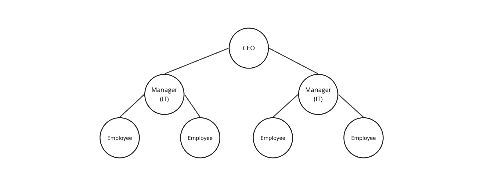

# Introduction to Tree

In data structure, tree is another way to organize the data.

When to use the tree and why?

Let's say you have a big company and your company have a large number of employees, the company have CEO, managers, directors.. How would you orgnanize the employees considering their roles/position?

Tree should be considered here, lets's see how the company employees would be organized using the tree as the below image (figuer 1):

Figure 1

## Concept

A tree is a collection of nodes that are connected by edges and has a hierarchical relationship between the nodes.

Figure 2

**Types of tree**

1 - Binary tree

- A tree where the node has at most two child.

2 - Binary search tree (BST)

- A tree where the node at most has two child 
- A tree where the left subtree is less than the root
- A tree where the right subtree is bigger than the root

3 - AVL tree

- A self-balancing binary search tree
- Each node stores a value called a `balanced factor`, whose value is either -1, 0 or 1.
- `balanced factor` = (height of left subtree - height of right subtree) or (height of right subtree - height of left subtree)
- The tree in figure 2 is AVL tree.
- Example: The `balanced factor` for the node `A` = (height of left subtree {1} - height of right subtree {1}) = {0}.
  
4 - B-tree
- A special kind of self balancing tree, where the node can contain more than one key and can have more then two child.

**Tree Traversal**

The process of visiting required node to perform special operation or visiting each node and print their values.

There are three ways to travers tree:

1- Pre-order traversal

- Visit the root node
- Visit all nodes from the left side
- Visit all node from the right side
- Example: in figuer 2, the pre-order path is: A -> 

2-
3-

## Example 

### Primitive 

### non-primitive

## Projects

