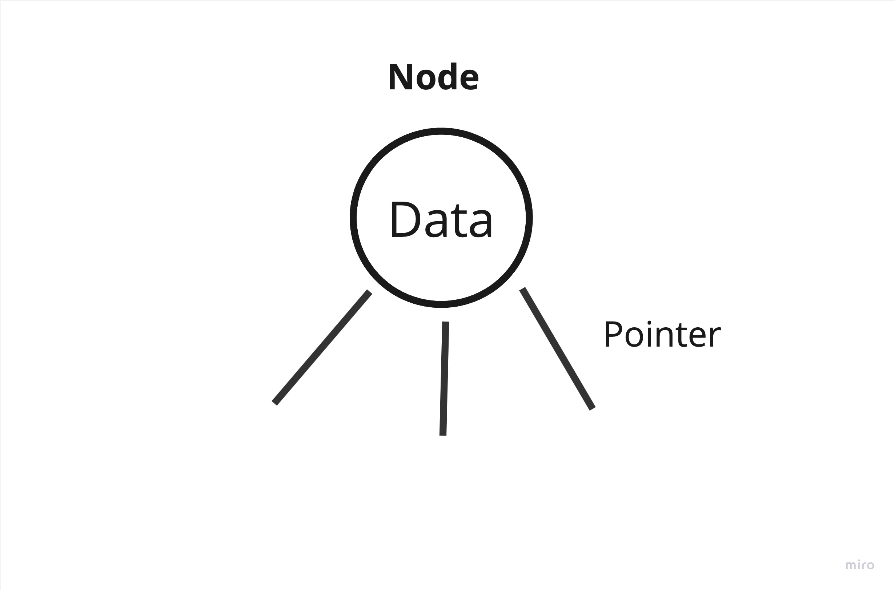

# Introduction to Tree

In data structure, tree is another way to organize the data.

When to use the tree and why?

Let's say you have a big company and your company have a large number of employees, the company have CEO, managers, directors.. How would you orgnanize the employees considering their roles/position?

Tree should be considered here, lets's see how the company employees would be organized using the tree as the below image (figuer 1):

Figure 1


## Concept

A tree is a collection of nodes that are connected by edges and has a hierarchical relationship between the nodes.

Figure 2


## Implementation
As we explaind before, the tree is a collection of nodes, but what is the node? and how to implement it?

`Node` is the element that will hold the **data** and the **pointer** to the children.

Figure 3



- `Node` class implementation:

```java

public class Node {

    // Data
    int number;
    // Pointers
    Node left;
    Node center;
    Node right;
}

```

The above code is representing a `node` of integer **data** type and the **pointers** as references to the nodes children.   
The node here have only 3 pointers that means it can have only 3 children

- Now let's add a constructor to the `node` class and create an object of node with the name **root** in the main function.
```java

public class Node {

    // Data
    int number;
    // Pointers
    Node left;
    Node center;
    Node right;

    // Constructor
    Node(int number){
        this.number = number;
        this.left = null;
        this.center = null;
        this.right = null;
    }

 public static void main(String[] args) {
        
        // Create an object of node
        Node root = new Node(1);

}

}

```

In the above code:     
The node **data** is (1).  
At the moment the **pointers** is refrencing to (null) as there is no node children created yet.  

- Now lets's see how to update the node **data**? we will update the **data** to be (3).

```java

public class Node {

     // Data
    int number;
    // Pointers
    Node left;
    Node center;
    Node right;

    // Constructor
    Node(int number){
        this.number = number;
        this.left = null;
        this.center = null;
        this.right = null;
    }

 public static void main(String[] args) {
        
        // Create an object of node
        Node root = new Node(1);

        // Update the node data
        root.number = 3;


}

}

```

- Now We will see how to create a child for the **root** node?   
1 - Craete node object with the name **child**.   
2 - Link/add **child** object to the **root** children (left/center/right).

```java

public class Node {

     // Data
    int number;
    // Pointers
    Node left;
    Node center;
    Node right;

    // Constructor
    Node(int number){
        this.number = number;
        this.left = null;
        this.center = null;
        this.right = null;
    }

 public static void main(String[] args) {
        
        // Create an object of node
        Node root = new Node(1);

        // Update the node data
        root.number = 3;


        // Create an object of node
        Node child = new Node(2);


        // Add child object to the root children (left/center/right).
        root.left = child;

}

}
```


- **Tree traversal**

The process of visiting required node to perform special operation or visiting each node and print their values.

There are three ways to travers tree:

1- Pre-order traversal

- Visit the root node
- Visit all nodes from the left side
- Visit all node from the right side
- Example: in figuer 2, the pre-order path is: `A -> B -> D -> E -> C -> F -> G -> H`.

2- In-order traversal

- Visit all nodes from the left side
- Visit the root node
- Visit all node from the right side
- Example: in figuer 2, the in-order path is: `D -> B -> E -> A -> F -> C -> G -> H`.


3- Post-order traversal

- Visit all nodes from the left side
- Visit all node from the right side
- Visit the root node
- Example: in figuer 2, the post-order path is: `D -> E -> B -> F -> H -> G -> C -> A`.

<br/>


- **Types of tree**

1 - General Tree

- A tree where there are no constraints on the hierarchical structure.
- A tree where a node can have any number of child nodes.

2 - Binary tree

- A tree where the node has at most two child.

3 - Binary search tree (BST)

- A tree where the node at most has two child 
- A tree where the left subtree is less than the root
- A tree where the right subtree is bigger than the root

4 - AVL tree

- A self-balancing binary search tree
- Each node stores a value called a `balanced factor`, whose value is either -1, 0 or 1.
- `balanced factor` = (height of left subtree - height of right subtree) or (height of right subtree - height of left subtree)
- The tree in figure 2 is AVL tree.
- Example: The `balanced factor` for the node `A` = (height of left subtree {1} - height of right subtree {1}) = {0}.
  
5 - B-tree
- A special kind of self balancing tree, where the node can contain more than one key and can have more then two child.


## Projects

Project ID | Project Title | Deadline |
|:-----|:-----------:|:-------------|
|TreeProject01| [Tree with primitive data types](projects/introduction-to-tree/01-premetive-tree-creation/README.md) | - | 


