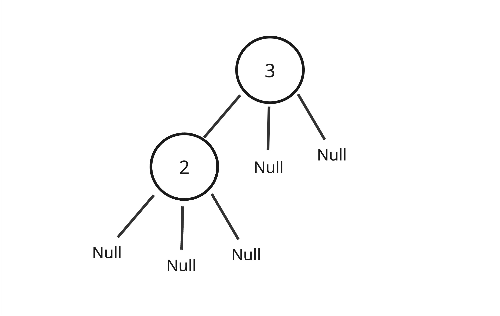

# Introduction to tree

In data structure, tree is another way to organize the data.

When to use the tree and why?

Let's say you have a big company and your company have a large number of employees, the company have CEO, managers, directors.. How would you orgnanize the employees considering their roles/position?

Tree should be considered here, lets's see how the company employees would be organized using the tree as the below image (figuer 1):

Figure 1


## Concept

`Tree` is a collection of nodes that are connected by edges and non-linear data structure, which represent nodes in a hierarchical order.

Figure 2


## Implementation
As we explained before, the tree is a collection of nodes, and each node in the tree will contain data and pointers. The pointers in the tree node will depend on how many children a node can have, for example, let us implement a tree with a maximum of three children (left, center, and right). The node will look as the following (Figure 3).

Figure 3


As always, to implement the tree we will define the `Node` class first since it is the main component that will construct the whole tree.

- `Node` class implementation:

```java
public class Node {

    // Data
    int number;
    // Pointers
    Node left;
    Node center;
    Node right;

    // Constructor
    Node(int number){
        this.number = number;
        this.left = null;
        this.center = null;
        this.right = null;
    }

}

```

<br/>
<br/>

- Create an object of `node` with the name **root** in the main function.
```java
public static void main(String[] args) {
Node root = new Node(1);
}
```

>**root data**: _number_ = 1.   
>**pointers**: ( _left_ , _center_ , _right_ ) = null. as there is no node children created yet.

<br/>
<br/>

- Access the **root** data and print it.
```java
// print the root value
System.out.println(root.number);
```

Output:
```java
1
```

<br/>
<br/>

- Update the **root** data to be (3)

```java
root.number = 3;
```

<br/>
<br/>

Since the node class is covered.
Now we will explain how to **implement the complete tree**, **linking nodes together** and **perform operations on it**.

- `Tree` class implementation:

1 - Create tree.  
2 - Create tree root (node object).  
3 - Access the _root_ data and print it.  
4 - Update the _root_ data to be (3).  
5 - Create root child (left child).  
6 - Print tree values.


```java 

public class Tree {

    Node root;

    Tree(int number) {
        root = new Node(number);
    }

    Tree() {
        root = null;
    }

    // Print tree values function
    public void printTreeValues(Node node) {
        if (node != null) {
            printTreeValues(node.left);
            System.out.println(" " + node.number);
            printTreeValues(node.right);
        }
    }

    public static void main(String[] args) {

        // 1 - Create Tree
        Tree T = new Tree();

        // 2 - Create tree root (node object)
        T.root = new Node(1);

        // 3 - Access the root data and print it\
        System.out.println("Print root value");
        System.out.println(T.root.number);

        // 4 - Update the root data to be (3)
        T.root.number = 3;

        // 5 - Create root child (left child)
        T.root.left = new Node(2);

        // 6 - Print tree values
        System.out.println("Print tree values");
        T.printTreeValues(T.root);

    }

}


```

>Note: in printTreeValues function, we used a specific method called in-ordert traverse. It will be explained in the following sections.

Output:
```java
Print root value
1
Print tree values
2
3
```

After running the previous code, the `Tree` will look like the following (figure 4).

Figure 4


<br/>
<br/>


- `Tree` Implementation with non-premitive data type.   
We will follow the same logic, steps and code of the above tree but for **employees** instead of integers.

- `Employee` class:

```java
public class Employee {

    int id;
    String name;
    String role;

    Employee(int id, String name, String role){
        this.id = id;
        this.name = name;
        this.role = role;
    }
  
}
```


- `Node` class

```java

public class Node {

    // Data
    Employee employeeData;
    // Pointers
    Node left;
    Node center;
    Node right;

    // Constructor
    Node(Employee e) {
        this.employeeData = e;
        this.left = null;
        this.center = null;
        this.right = null;
    }

}
```

- `Tree` class

```java

public class Tree {

    Node root;

    Tree(Employee e) {
        root = new Node(e);
    }

    Tree() {
        root = null;
    }

    // Print tree values function
    public void printTreeValues(Node node) {
        if (node != null) {
            printTreeValues(node.left);
            System.out.println(" " + node.employeeData.name);
            printTreeValues(node.right);
        }
    }

    public static void main(String[] args) {

        // 1 - Create Tree
        Tree T = new Tree();

        // 2 - Create tree root (node object)
        T.root = new Node( new Employee(01,"Ahmed","CEO") );

        // 3 - Access the root data and print it
        System.out.println("Print root value");
        System.out.println(T.root.employeeData.name);

        // 4 - Access and update the root data (employee name) to be (Anas)
        T.root.employeeData.name = "Anas";

        // 5 - Create root child (left child)
        T.root.left = new Node(new Employee(02,"Khalid","HR Manager"));

        // 6 - Print tree values
        System.out.println("Print tree values");
        T.printTreeValues(T.root);

    }

}


```
Output:

```java
Print root value
Ahmed
Print tree values
Khalid
Anas
```

<br/>

After running the previous code, the `Tree` will look like the following (figure 5).

Figure 5


<br/>
<br/>

Knowing that we have covered the basics of bulding the tree, we will learn more oporations to perform on the tree.
let's say wa have the following employees tree that stores the employees names only:

Figure 6


We have multiple 4 operation to perform on the above tree:

- Operartion 1: search node
search and find specific node

We will search and find **Yasser**:

- Operartion 2: delete node
delete specific node


- Operartion 3: insert node 
insert node in a specific place

- Operartion 4: update node 
update specific node 


- **Tree traversal**

The process of Access required node to perform special operation or visiting each node and print their values.

There are three ways to travers tree:

1- Pre-order traversal

- Access the root node
- Access all nodes from the left side
- Access all node from the right side
- Example: in figuer 2, the pre-order path is: `A -> B -> D -> E -> C -> F -> G -> H`.

2- In-order traversal

- Access all nodes from the left side
- Access the root node
- Access all node from the right side
- Example: in figuer 2, the in-order path is: `D -> B -> E -> A -> F -> C -> G -> H`.


3- Post-order traversal

- Access all nodes from the left side
- Access all node from the right side
- Access the root node
- Example: in figuer 2, the post-order path is: `D -> E -> B -> F -> H -> G -> C -> A`.

<br/>


## Types

1 - General Tree

- A tree where there are no constraints on the hierarchical structure.
- A tree where a node can have any number of child nodes.

2 - Binary tree

- A tree where the node has at most two child.

3 - Binary search tree (BST)

- A tree where the node at most has two child 
- A tree where the left subtree is less than the root
- A tree where the right subtree is bigger than the root

4 - AVL tree

- A self-balancing binary search tree
- Each node stores a value called a `balanced factor`, whose value is either -1, 0 or 1.
- `balanced factor` = (height of left subtree - height of right subtree) or (height of right subtree - height of left subtree)
- The tree in figure 2 is AVL tree.
- Example: The `balanced factor` for the node `A` = (height of left subtree {1} - height of right subtree {1}) = {0}.
  
5 - B-tree
- A special kind of self balancing tree, where the node can contain more than one key and can have more then two child.


## Projects

Project Title | Deadline |
|:-----------:|:-------------|
[Tree with non-primitive data types](https://github.com/SAFCSP-Team/tree-with-non-premitive-data-type/tree/main) | -


