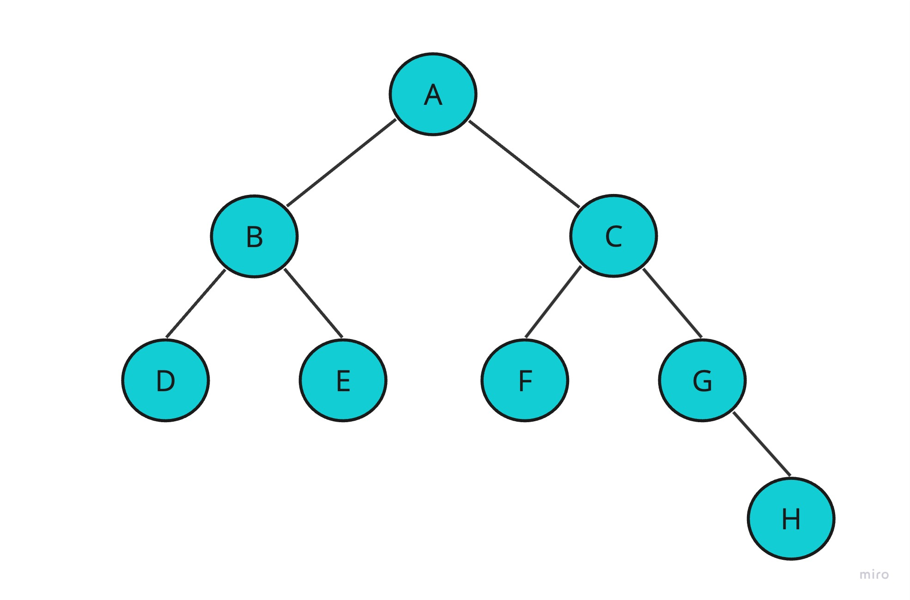

# Binary tree
Binary tree is type of tree data structure and it will be covered in the following sections.

## Concept

Binary tree is a tree where every node has maximum two child nodes 


**Types of binary tree**
<br/>

Figure 1


1 - Full Binary Tree
- A tree where tree nodes can have either two children or no child.
  

2 - Complete Binary Tree 
- A tree where each nodes on all levels except the last level has two children.
- A tree where at the lowest level, all leaves should reside possibly on the left side.


3 - Perfect Binary Tree
- A tree where every node must have two children and every leaf is present on the same level.


4 - Balanced Binary Tree
- `Balance factor` = height(left subtree) - height(right subtree)
- It balances a binary tree for each node if its `balance factor` is either -1,0 or 1. The height of the left subtree and that of the right tree can vary by at most one.


5 - Degenerate Binary Tree
- A tree where every `internal nodes` has exactly one child.
- `Internal node`: Any node with a child and a parent

<br/>

**Tree traversal**

The process of Access required node to perform special operation or visiting each node and print their values.

Figure 2


There are three ways to travers tree:

1- Pre-order traversal

- Access the root node
- Access all nodes from the left side
- Access all node from the right side
- Example: in figuer 2, the pre-order path is: `A -> B -> D -> E -> C -> F -> G -> H`.

2- In-order traversal

- Access all nodes from the left side
- Access the root node
- Access all node from the right side
- Example: in figuer 2, the in-order path is: `D -> B -> E -> A -> F -> C -> G -> H`.


3- Post-order traversal

- Access all nodes from the left side
- Access all node from the right side
- Access the root node
- Example: in figuer 2, the post-order path is: `D -> E -> B -> F -> H -> G -> C -> A`.

<br/>


## Example 
We will create a tree of integers and we will perform the traversal operations on it.  
Since the `binary tree` has maximun two children, then the node should have only two pointers (left and right).

### Primitive 

- In `node` class we will declare the attributes (data and pointers), create a constructor.

```java

class Node {
  int key;
  Node left, right;

  public Node(int item) {
  key = item;
  left = right = null;
  }
}
```

- In `binary tree` class we will declare the root as an attribute, create constructor, create traversal operations/functions to print the nodes values.

- In `main` we will create node, create a tree of nodes, perform traversal operations/functions.

```java

class BinaryTree {
  Node root;

  BinaryTree(Node root) {
    this.root = root;
  }

  BinaryTree() {
    root = null;
  }

  // Pre-order traverse
  public void printTreeValues(Node root) {

    if (root == null) {
      System.out.println("Tree is empty");
      return;
    }

    Stack<Node> stack = new Stack<Node>();
    stack.push(root);

    while (!stack.isEmpty()) {
      Node currentNode = stack.pop();

      System.out.print(" " + currentNode.key);

      if (currentNode.right != null) {
        stack.push(currentNode.right);
      }

      if (currentNode.left != null) {
        stack.push(currentNode.left);
      }

    }

    return;
  }

  public void addRight(Node parent, Node newNode) {

    if (root == null) {
      System.out.println("Tree is empty");
      return;
    }

    Stack<Node> stack = new Stack<Node>();
    stack.push(root);

    while (!stack.isEmpty()) {
      Node currentNode = stack.pop();

      if (currentNode == parent) {

        if (currentNode.right == null) {
          currentNode.right = newNode;
          System.out.println("child added successfully");
        } else {
          System.out.println("parent already has a right child");
          return;
        }

      }

      if (currentNode.right != null) {
        stack.push(currentNode.right);
      }

      if (currentNode.left != null) {
        stack.push(currentNode.left);
      }

    }

    return;
  }

  public void addLeft(Node parent, Node newNode) {

    if (root == null) {
      System.out.println("Tree is empty");
      return;
    }

    Stack<Node> stack = new Stack<Node>();
    stack.push(root);

    while (!stack.isEmpty()) {
      Node currentNode = stack.pop();

      if (currentNode == parent) {

        if (currentNode.left == null) {
          currentNode.left = newNode;
          System.out.println("Child added successfully");
        } else {
          System.out.println("Parent already has a left child");
          return;
        }

      }

      if (currentNode.right != null) {
        stack.push(currentNode.right);
      }

      if (currentNode.left != null) {
        stack.push(currentNode.left);
      }

    }

    return;
  }

  public static void main(String[] args) {
    
    // Root creation
    BinaryTree tree = new BinaryTree(new Node(1));

    // Add children to root
    tree.addLeft(tree.root, new Node(2));
    tree.addRight(tree.root, new Node(3));

    // Add children to left child
    tree.addLeft(tree.root.left, new Node(4));
    tree.addRight(tree.root.left, new Node(5));

    // Add children to right child
    tree.addLeft(tree.root.right, new Node(6));
    tree.addRight(tree.root.right, new Node(7));

    System.out.print("Print tree values");
    tree.printTreeValues(tree.root);

  }

}
```

Output
```
Child added successfully
child added successfully
Child added successfully
child added successfully
Child added successfully
child added successfully
Print tree values 1 2 4 5 3 6 7              
```

## Projects

Project Title | Deadline |
|:-----------:|:-------------|
|[Tree with non primitive (Employees) data types](https://github.com/SAFCSP-Team/binary-tree-with-non-premetive-data-type) | - | 


