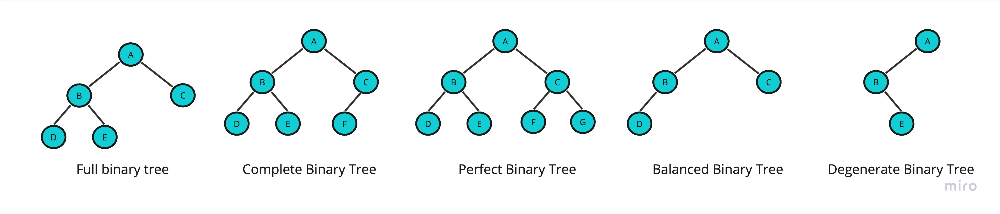

# Introduction to binary tree

Binary tree is a tree useed to store and organize hierarchical data

## Concept

Binary tree is a tree where every node has maximum two child nodes 


**Types of binary tree**
<br/>

Figure 1


1 - Full Binary Tree
- A tree where tree nodes can have either two children or no child.
  

2 - Complete Binary Tree 
- A tree where each nodes on all levels except the last level has two children.
- A tree where at the lowest level, all leaves should reside possibly on the left side.


3 - Perfect Binary Tree
- A tree where every node must have two children and every leaf is present on the same level.


4 - Balanced Binary Tree
- `Balance factor` = height(left subtree) - height(right subtree)
- It balances a binary tree for each node if its `balance factor` is either -1,0 or 1. The height of the left subtree and that of the right tree can vary by at most one.


5 - Degenerate Binary Tree
- A tree where every `internal nodes` has exactly one child.
- `Internal node`: Any node with a child and a parent


We looked into the different types of binary trees. Now you will see some operations you can perform on binary trees.


**Binary tree operation**
<br/>

1 - Create node

2 - Create tree of nodes

How Do You Traverse a Binary Tree in Data Structures?

Traverse: The process of visiting required node to perform special operation or visiting each node and perform an action, for example: print their values.

There are three ways to travers tree:

1- Pre-order traversal

- Visit the root node
- Visit all nodes from the left side
- Visit all node from the right side

2- In-order traversal

- Visit all nodes from the left side
- Visit the root node
- Visit all node from the right side


3- Post-order traversal

- Visit all nodes from the left side
- Visit all node from the right side
- Visit the root node


We will look into these operation in the example section


## Example 
We will crete a tree of integers and we will perform the operations on it.

### Primitive 

- In `node` class we will declate the attibutes, create a constructor.

```java

class Node {
  int key;
  Node left, right;

  public Node(int item) {
  key = item;
  left = right = null;
  }
}
```

- In `binary tree` class we will declare the root as an attribute, create constructor, create node, create a tree of nodes, traversal operations/functions.

```java

class BinaryTree {
  Node root;

  BinaryTree(int key) {
  root = new Node(key);
  }

  BinaryTree() {
  root = null;
  }

  // Traverse Inorder
  public void traverseInOrder(Node node) {
  if (node != null) {
    traverseInOrder(node.left);
    System.out.print(" " + node.key);
    traverseInOrder(node.right);
  }
  }

  // Traverse Postorder
  public void traversePostOrder(Node node) {
  if (node != null) {
    traversePostOrder(node.left);
    traversePostOrder(node.right);
    System.out.print(" " + node.key);
  }
  }

  // Traverse Preorder
  public void traversePreOrder(Node node) {
  if (node != null) {
    System.out.print(" " + node.key);
    traversePreOrder(node.left);
    traversePreOrder(node.right);
  }
  }

  public static void main(String[] args) {
  BinaryTree tree = new BinaryTree();

  tree.root = new Node(1);
  tree.root.left = new Node(2);
  tree.root.right = new Node(3);
  tree.root.left.left = new Node(4);

  System.out.print("Pre order Traversal: ");
  tree.traversePreOrder(tree.root);
  System.out.print("\nIn order Traversal: ");
  tree.traverseInOrder(tree.root);
  System.out.print("\nPost order Traversal: ");
  tree.traversePostOrder(tree.root);
  }
}

```

Output
```
Pre order Traversal:  1 2 4 3
In order Traversal:  4 2 1 3
Post order Traversal:  4 2 3 1
```

## Projects

Project ID | Project Title | Deadline |
|:-----|:-----------:|:-------------|
|TreeProject02| [Tree with non primitive (Employees) data types](projects/binary-tree/README.md) | - | 


