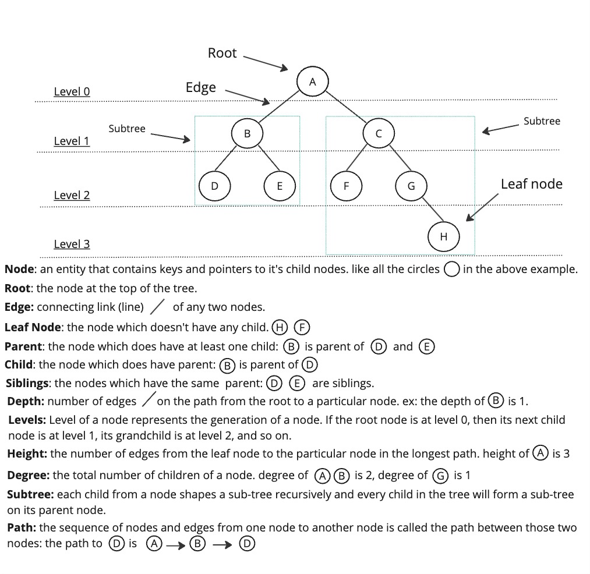

# Introduction to Tree

In data structure, tree is another way to organize the data.

when to use the tree and why?

let's say you have a big company and your company have a large number of employees. How would you orgnanize the employees in considering their company roles/position?

Tree should be considered here, lets's see how would the company employees would be organized using the tree as the below image:

## Concept

A tree is a collection of nodes that are connected by edges and has a hierarchical relationship between the nodes.

## Example 

### Primitive 

### non-primitive

## Projects

