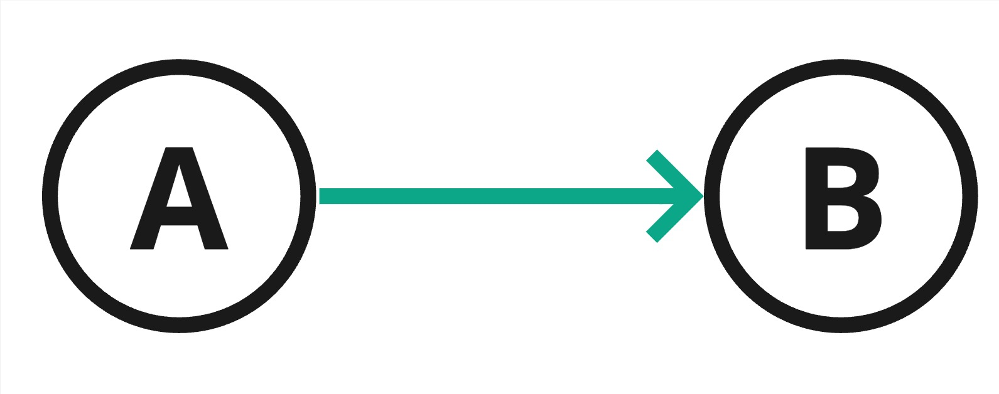

# Graph
Graph is data structure and mathematical concept that is used to represent relationships between objects.

For some cases it's hard to define the relationship between objects, specially if the relationship is complex.

Let's see one of the use case of the graph.

If we have a relationship between three objects, for example (Khaled, Fahad, and Majed).

Khaled knows Fahad. And Fahad knows Khaled and Majed, but Majed doesn't know neither Khaled nor Fahad. How can we store this represen the relationship between them? 

Well, we can use **Graph** to store this relationship. Graph is a data structure that stores objects and their relationships with other objects.

> We can represent the connection between them as a graph drawing.


> Where the circles are the objects and the arrows are the relationship between them.
> The objects in the graph are called a vertex
> The relationship that connects to vertices is called an edge
 
## Concept
A **Graph is a non-linear data structure** It's a way to organize data by storing objects and their relationships with other objects, which are called **vertices** and **edges**. 

> Generally, graphs are used to model problems defined in terms of relationships or connections between objects. One example of this is a social network, where the vertices are people and the edges are friendship relationships between them.

> **vertices** are another name for **nodes**.

### Graph Attributes

* **Vertex** is an object that can store data. 
> In the example above, the vertices are objects that represent people.


* **Edge** is a connection between two vertices.
> In the example above, the edges are the relationship between the people.


## Types

* ###  **Directed Graph** 
The edges in a directed graph have one direction. This means that the edges only go one way. 

Vertex A has an edge to vertex B, but B doesn't have an edge to A. That means we can go from A to B but we can't go from B to A.



> It's like a one-way street, where you can go from A to B but you can't go from B to A.

<hr>

* ### **Undirected Graph** 
The edges in an undirected do not have a specified direction. This means that the edges can go both ways.

Vertex A has an edge to vertex B, and B has an edge to A. That means we can go from A to B and from B to A.


> It's like a two-way street, where you can go from A to B and from B to A.

<hr>

* ### **Weighted Graph**
It's a graph that has a value on each edge, the edge value is referred to as **weight** or **cost**.

An example of the weighted graph is map navigation, where the **vertices** are the cities and the **edges** are the roads between the cities. The **weight** of the edge is the **distance** between the cities.

> The difference between the edges and weighted is that the edges are just a connection between the vertices, but the weighted have a value of the edge.


## Terminology
* **Simple Graph** - A simple graph is an unweighted, undirected graph containing no loops or multiple edges.
* **In-degree** - The number of edges pointing to a vertex in a directed graph.
* **Out-degree** - The number of edges pointing out of a vertex in a directed graph.
* **Path** - A path is a sequence of edges between two vertices.
* **Self-Loop** - A self-loop is a vertex that has an edge to itself.

> Vertex A is self-loop.


* **Cyclic Graph** - A vertex that can traverse through a path and return to itself.


* **Acyclic Graph** - When a directed graph doesn't have a cyclic vertex it's called Acyclic.
* **Connected Graph** - A connected graph is a graph in which each vertex is connected to at least one other vertex.


* **Disconnected Graph** - A disconnected graph is a graph where some vertices may not have edges.


* **Complete Graph** - A complete graph is a graph where each vertex is connected to every other vertex.


* **Subgraph** - A subgraph is a subset of the vertices and edges of a graph.


* **Strongly Connected Graph** - A directed graph is strongly connected when there is a path between each pair of vertices. e.g. vertex A can go to any other vertex.


* **Weakly Connected Graph** - A directed graph is weakly connected when a graph have connection between all the vertices, but has vertex with no out-degree. e.g. vertex B can't go to any other vertex.


### Graph Representation
The most common way to represent a graph relation on data structure is by using **Adjacency Matrix** or **Adjacency List**.

* **Adjacency Matrix**

We can represent a graph using a two-dimensional array. Where the rows represent the source vertex and the columns represent the destination vertex. If the value is 1, that means that the source vertex is connected and if the value is 0, that means that the source vertex is not connected.


<br><br>

* **Adjacency List**

We can represent a graph using array of linked list. Where the index of the array list represent the source vertex and the linked list represent the destination vertex.


<br><br>


## Implementation
In this seciton we will implement **the directed graph**

### Adjacency Matrix

It's way to represent a graph relation by using two-dimensional array.

1. Create a class called **Vertex** that has data and a constructor that takes the data as a parameter.
   
```java

public class Vertex {

    char data;

    public Vertex(char data) {
        this.data = data;
    }
}

```

2. Create a class called **Graph** that has an array list of Vertex and in the constructor initialize the array list.

```java
import java.util.ArrayList;

public class Graph {

    public ArrayList<Vertex> vertices; // declare an array list of Vertex

    public Graph() {
        vertices = new ArrayList<>(); // initialize the array list of Vertex
    }
}

```
> Now we have created two classes, one for the vertex and the other for the graph. The next step is to create a method to add a vertex to the graph.

3. In **Graph** class, create a method called **addVertex** that takes an object of type Vertex and store it in the array list.

```java

public void addVertex(Vertex vertex) {
        vertices.add(vertex);
    }

```

4. Now we can test the graph. In main method, create an object from the **Graph** class and add the vertices A and B to the graph.

```java

public class Main {

    public static void main(String[] args) {
        Graph graph = new Graph();

        graph.addVertex(new Vertex('A'));
        graph.addVertex(new Vertex('B'));

        System.out.println(graph.vertices.get(0).data);
        System.out.println(graph.vertices.get(1).data);
    }
}

```

**OUTPUT** 

```
A
B
```

Right now we have only created a vertices but we didn't create a relationship between them.
> We can create a relations by using adjacency matrix 

5. Create a vertices relation using adjacency matrix. In the Graph class create a two dimensional array, whcih will hold the vertices relation.

```java
public class Graph {

    public ArrayList<Vertex> vertices;

    int [][] adjMatrix; // two-dimensional array

    public Graph() {
        vertices = new ArrayList<>();
        adjMatrix = new int[vertices.size()][vertices.size()]; // initialize the adjaceny matrix with the size of vertices length
    }

    public void addVertex(Vertex vertex) { vertices.add(vertex); }
}

```


6. In Graph class create a method called **addEdge** that takes two parameters, source and destination.

```java
public void addEdge(int src, int dst) {
        adjMatrix[src][dst] = 1;
    }
```


7. Call **addEdge** in the main method, and pass the index of A and B, to create an edge between the node A and B.

```java
public class Main {

    public static void main(String[] args) {
        Graph graph = new Graph(2);

        graph.addVertex(new Vertex('A')); // index 0
        graph.addVertex(new Vertex('B')); // index 1

        graph.addEdge(0, 1); // This will connect A to B

    }
}
```

> In the graph constructor, we have passed 2 as a parameter, which is the count of the vertices. 

We have succssfully created a graph with two vertices and an edge between them.


> Vertice A is adjacent to B

<br>

8. Create a method to **print** the graph using **Adjacency Matrix**.

```java
    public void display() {
        System.out.print("\t");
        for (int i = 0; i < vertices.size(); i++) {
            System.out.print(vertices.get(i).data + " "); // print vertices destination
        }
        System.out.println();
        for (int i = 0; i < vertices.size(); i++) {

            System.out.print(vertices.get(i).data + "\t"); // print vertices source
            for (int j = 0; j < vertices.size(); j++) {
                System.out.print(adjMatrix[i][j] + " "); // print two-dimensional array
            }
            System.out.println();
        }
    }
```

9. Call the **display** method in the main method, to print the graph.

```java
    public static void main(String[] args) {
        Graph graph = new Graph(2);

        graph.addVertex(new Vertex('A'));
        graph.addVertex(new Vertex('B'));

        graph.addEdge(0, 1);

        graph.display();

    }
```

**OUTPUT**

```
	A B 
A	0 1 
B	0 0 
```

10. Create a method called **removeEdge**, it's similar to **addEdge** method, but instead of setting the value to 1, we set it to 0.

```java

    public void removeEdge(int src, int dst) {
        adjMatrix[src][dst] = 0;
    }

```

11. Call **removeEdge** in the main method, and pass the index of A and B.

```java

public static void main(String[] args) {
        Graph graph = new Graph(2);

        graph.addVertex(new Vertex('A'));
        graph.addVertex(new Vertex('B'));

        graph.addEdge(0, 1);

        graph.removeEdge(0, 1);

        graph.display();

    }

```

**OUTPUT**

```
	A B 
A	0 0 
B	0 0 
```

### Adjacency List

Another way to represent a graph relation is by using **Adjacency List**, which is an array list of linked list.

1. Create a class called **Vertex** that has data and a constructor that takes the data as a parameter.
   
```java

public class Vertex {

    char data;

    public Vertex(char data) {
        this.data = data;
    }
}
```

2. Create a class called **Graph** that has an array list of linked list of Vertex and in the constructor initialize the array list of linked list.

```java
    import java.util.ArrayList;
    import java.util.LinkedList;

    public class Graph {

        public ArrayList<LinkedList<Vertex>> vertices;

        public Graph() {
            vertices = new ArrayList<>();
        }
    }
```

> ArrayList or Dynamic Array is a resizable array. It's like an array but it's size is not fixed.

3. Create a method called **addVertex** that takes a vertex as a parameter and add it to the array list of linked list.

```java

    public void addVertex(Vertex v) {
        LinkedList<Vertex> list = new LinkedList<>();
        list.add(v);
        vertices.add(list);
    }
```

4. Call **addVertex** in the main method, and pass the vertex A as a parameter.

```java
    class Main {
        public static void main(String[] args) {

            Graph graph = new Graph();

            graph.addVertex(new Vertex('A'));
            System.out.println(graph.vertices.get(0).get(0).data);
        }
    }
```

**OUTPUT**

```
A
```

5. Create a method called **addEdge** that takes two parameters, source and destination.

```java
    public void addEdge(int src, int dst) {
        LinkedList<Vertex> list = vertices.get(src); // get the list of vertices at index src
        Vertex dstVertex = vertices.get(dst).get(0); // get the vertex at index dst
        list.add(dstVertex); // add the vertex to the list
    }
```

6. Call the **addEdge** method in the main method, and add vertiecs A, B, and C. Connect A to B and B to C.

```java

    Graph graph = new Graph();

    graph.addVertex(new Vertex('A'));
    graph.addVertex(new Vertex('B'));
    graph.addVertex(new Vertex('C'));
    graph.addEdge(0, 1);
    graph.addEdge(1, 2);
    graph.addEdge(2, 0);

```

7. In the Graph class, Create a print method that prints the graph using adjacency list.

```java

    public void print() {
        for (LinkedList<Vertex> list : vertices) {
            for (Vertex node : list) {
                System.out.print(node.data + " -> ");
            }
            System.out.println();
        }
    }

```

8. Call **print** in the main method.

```java

    class Main {
        public static void main(String[] args) {

            Graph graph = new Graph();

            graph.addVertex(new Vertex('A'));
            graph.addVertex(new Vertex('B'));
            graph.addVertex(new Vertex('C'));
            graph.addEdge(0, 1);
            graph.addEdge(1, 2);
            graph.addEdge(2, 0);

            graph.print();
        }
    }

```

**OUTPUT**

```
A -> B -> 
B -> C -> 
C -> A -> 
```


## Projects

Project ID | Project Title | Deadline |
|:-----|:-----------:|:-------------|
|GraphProject01| [Graph](https://github.com/SAFCSP-Team/introduction-to-graph-project) | - | 
