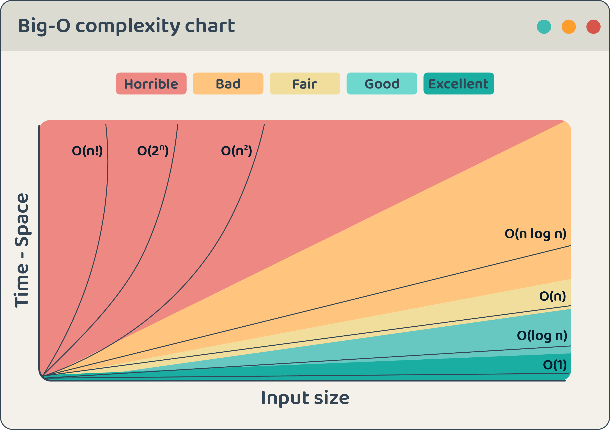

# Introduction to Time and Space Complexity

<!--- Why is there more than one way to write/perform an algorithm --->
We know that in order to solve a problem, we need to write an algorithm. But, what if we have more than one algorithm to solve the problem, e.g. sorting an array, we can use **bubble sort, or merge sort**, and so on.

So, we have more than an algorithm that solves a problem, we need to know how to measure the performance of an algorithm and compare them to determine which one is the best for a given problem.

It's the **algorithm's efficiency**, and when we say efficiency, we mean **time complexity and space complexity.**


## Concept 
<!--- What is time and space complexity --->
**Time complexity** is the **time** that an algorithm takes to complete a task. 

**Space complexity** is the **space in memory** that an algorithm takes to complete a task.


So, **time complexity** and **space complexity** are the **two main factors that affect the performance** of our algorithm, and **choosing the best algorithm for a given problem is based on it**.

<!--- What is the purpose of time and space complexity --->

Each computer runs the algorithm faster than the other, that's because they have different hardware capabilities, and that's why we need to have a way to measure the time and space complexity regardless of the hardware capabilities. 


<!--- Note CPU and Memory --->
> * **Time complexity** depends on the **CPU speed** and the number of instructions that the CPU can execute in a given time.
> * **Space complexity** depends on the **memory size** and the number of variables that the algorithm uses.


<!--- Link the big O --->

We can measure the time and space complexity for each algorithm regardless of the hardware capabilities by using the `Big O notation`.


### Big O notation

`Big O notation` is a **mathematical notation** used to **describe the performance** of an algorithm and express **how its running time or space requirements grow** with the input size. 

By utilizing Big O notation, we can **compare the efficiency** of different algorithms and make informed decisions about algorithm optimization.

Big O notation **is represented as** `O(f(n))`, where `f(n)` represents **the growth rate** of the algorithm and `n` represents the **input size**. The `O` **symbolizes the upper bound** of the growth rate.

It's important to understand that **Big O notation gives an upper bound on the growth rate** of an algorithm. It **focuses on the worst-case** scenario, assuming that the algorithm takes the **maximum time or space for any input**.

**The key time and space complexities:**


1. **O(1)** `Constant time`: The algorithm's **running time remains constant**, regardless of the input size. An example is accessing an element in an array by its index. Regardless of the size of the array, the time taken to access the element remains constant.


2. **O(log n)** `Logarithmic time`: **The running time grows logarithmically with the input size**. As the input size increases, the running time increases, but at a progressively slower rate. An example is Binary search on a sorted array recursive calls split the problem in half, reducing the time required decreases.

3. **O(n)** `Linear time`: **The running time grows linearly with the input size**. If the input size doubles, the running time will also roughly double. Examples include iterating through an array or performing a linear search.

4. **O(n log n)** `Linearithmic time`: **The running time grows in proportion to the number of elements multiplied by the logarithm of the number of elements**. This complexity often arises in efficient sorting algorithms like merge sort or quicksort.


5. **O(n^2)** `Quadratic time`: **The running time grows quadratically with the input size**. If the input size doubles, the running time will roughly increase by a factor of four. Examples include nested loops.


6. **O(2^n)** `Exponential time`: **The running time grows exponentially with the input size**. This represents algorithms with very slow performance as the input size increases. for example, the `Fibonacci` function makes two recursive calls for each level of recursion. This means that the number of recursive calls doubles with each increase in the input size.


- For instance, if you call Fibonacci(5), the function will make 15 recursive calls. However, if you call Fibonacci(10), it will make 1,023 recursive calls.

>  `Fibonacci`  function calculates the n-th number in the Fibonacci sequence recursively. The Fibonacci sequence is defined as follows: each number is the sum of the two preceding ones, starting from 0 and 1.

> The Big O notation **applies to both time and space complexities.**

The image below describes the growth rates of different complexities in Big O notation:



## Example
Algorithm: Sorting an array using different algorithms

1. Bubble Sort Implementation:
   ```java
   public static void bubbleSort(int[] arr) {
       int n = arr.length;
       for (int i = 0; i < n - 1; i++) {
           for (int j = 0; j < n - i - 1; j++) {
               if (arr[j] > arr[j + 1]) {
                   int temp = arr[j];
                   arr[j] = arr[j + 1];
                   arr[j + 1] = temp;
               }
           }
       }
   }
   ```

   - Time Complexity:
     - In the worst case, the algorithm requires iterating over the array multiple times, comparing and swapping adjacent elements until the array is sorted.
     - As the input size (n) increases, the number of iterations increases quadratically.
     - Therefore, the **time complexity is O(n^2)**, where n is the size of the array.

   - Space Complexity:
     - The algorithm uses a constant amount of additional space to store variables for the sorting process.
     - Regardless of the input size, **the space complexity remains O(1)**, indicating constant space usage.

2. Merge Sort Implementation:
   ```java
   public static void mergeSort(int[] arr, int left, int right) {
       if (left < right) {
           int mid = (left + right) / 2;
           mergeSort(arr, left, mid);
           mergeSort(arr, mid + 1, right);
           merge(arr, left, mid, right);
       }
   }

   private static void merge(int[] arr, int left, int mid, int right) {
       int n1 = mid - left + 1;
       int n2 = right - mid;

       int[] leftArr = new int[n1];
       int[] rightArr = new int[n2];

       for (int i = 0; i < n1; i++) {
           leftArr[i] = arr[left + i];
       }
       for (int j = 0; j < n2; j++) {
           rightArr[j] = arr[mid + 1 + j];
       }

       int i = 0, j = 0, k = left;

       while (i < n1 && j < n2) {
           if (leftArr[i] <= rightArr[j]) {
               arr[k] = leftArr[i];
               i++;
           } else {
               arr[k] = rightArr[j];
               j++;
           }
           k++;
       }

       while (i < n1) {
           arr[k] = leftArr[i];
           i++;
           k++;
       }

       while (j < n2) {
           arr[k] = rightArr[j];
           j++;
           k++;
       }
   }
   ```

   - Time Complexity:
     - The recursive calls have a logarithmic time complexity of O(log n), where n is the size of the array.
     - The merging process takes linear time O(n) in each recursive call.
     - Therefore, the **overall time complexity is O(n log n)**.

   - Space Complexity:
     - The algorithm uses additional space to create temporary arrays during the merge process.
     - In each recursive call, **the space complexity is O(n)**, where n is the size of the array.

3. Quick Sort Implementation:
   ```java
   public static void quickSort(int[] arr, int low, int high) {
       if (low < high) {
           int pivotIdx = partition(arr, low, high);
           quickSort(arr, low, pivotIdx - 1);
           quickSort(arr, pivotIdx + 1, high);
       }
   }

   private static int partition(int[] arr, int low, int high) {
       int pivot = arr[high];
       int i = low - 1;
       for (int j = low; j < high; j++) {
           if (arr[j] < pivot) {
               i++;
               int temp = arr[i];
               arr[i] = arr[j];
               arr[j] = temp;
           }
       }
       int temp = arr[i + 1];
       arr[i + 1] = arr[high];
       arr[high] = temp;
       return i + 1;
   }
   ```

   - Time Complexity:
     - The algorithm selects a pivot element, partitions the array, and recursively sorts the two resulting subarrays.
     - In the worst case, where the pivot always selects the smallest or largest element, **the time complexity becomes O(n^2)**.

   - Space Complexity:
     - The algorithm uses a small amount of additional space for the recursive function calls.
     - In the worst case, **the recursion depth can reach O(n)**.


## Project
Project ID | Project Title | Deadline |
|:-----|:-----------:|:-------------|
|DSA102| [Big O Notation](https://github.com/SAFCSP-Team/big-o-project) | - | 
