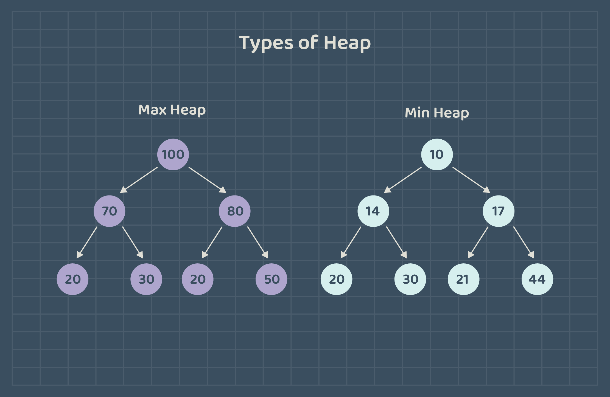

# Heap

## Concept 
`Heap` is a hierarchical data structure that can be implemented using various underlying structures, such as arrays or trees.  

**The heap property** ensures that the highest/lowest value element is always at the root of the heap. However, there is **no specific order or relationship between nodes** at any level, so the **heap is not sorted**.

**Types of Heaps**

There are two main types of heap:

`Max Heap` The value of each node is **less than or equal** to the value of the parent, and **the greatest value is at the root**.

`Min Heap` The value of each node is **greater than or equal** to the value of its parent, and **the smallest value is at the root**.



**Heap Operations**
- `heapify`: Constructs a heap from an unordered array.
- `insert`: Inserts an element into the heap while ensuring the heap property.
- `delete`: Removes an element from the heap while ensuring the heap property.
- `peek (Find max/min)`: Retrieves the highest/lowest priority element without removing it.
- `extract(Max/Min)`: Retrieves the highest/lowest priority element and removes.

Heaps have various applications, like:
- Heap is used while implementing a **priority queue**.
- **Heapsort** is a sorting algorithm that uses a heap to sort the value in ascending or descending order.
- **Binary Heap** is used for pathfinding algorithms to Find the shortest path between two points in a graph.

## Implementation
We are going to implement a `max-heap` class using an array. 

Each element in an array at index `i` has:
- A parent at index `(i-1)/2`.
- A left child at index `2 * i + 1`.
- A right child at index `2 * i + 2`.

1. MaxHeap Class Fields and the Constructor:
   
- **heap**: An array to store the elements of the heap.
- **count**: The number of elements currently stored in the heap.
- **MaxHeap**(int capacity) Constructor:
    - Initializes the heap array with the specified capacity.
    - Sets the count to 0, indicating an empty heap.

```java
public class MaxHeap {
    public int[] heap; 
    public int count; 
  
    public MaxHeap(int capacity) {
        heap = new int[capacity];
        count = 0; 
    }
  ```
2. isEmpty() Method: Returns true if the heap is empty (count is 0), false otherwise.
``` java
public boolean isEmpty() {
        return count == 0; 
    }
```
3. ensureCapacity() Method: Rresizes the array by doubling its length when it becomes full.
```java
    public void ensureCapacity() {
        if (count == heap.length) {
            int[] newHeap = new int[heap.length * 2];
            System.arraycopy(heap, 0, newHeap, 0, count);
            heap = newHeap;
        }
    }
  ```
4. insert(int value) Method: Inserts a new element into the heap.
- Calls `ensureCapacity()` to ensure enough space.
- Places the new element at the end of the heap and applies `heapifyUp` to maintain the heap property.

```java
   public void insert(int value) {
        ensureCapacity();
        heap[count++] = value;   
        heapifyUp(count - 1);  
    }
```
5. delete(int value) Method: Removes the specified value from the heap.
- Replace the element to be deleted with the last element in the heap.
- Resizes the array and calls `heapifyDown` to maintain the heap property.
```java
    public void delete(int value) {
        if (isEmpty()) {
            System.out.println("the heap is empty ");
        }
        // Search for the index of the required value
        int index = -1;
        for (int i = 0; i < count; i++) {
            if (heap[i] == value) {
                index = i;
                break;
            }
        }
        if (index == -1) {
            System.out.println("the element is not found ");
        }
        // Replaces the value with the last element in the heap and resizes the array.
        heap[index] = heap[--count];
        int[] newHeap = new int[heap.length -1];
        System.arraycopy(heap, 0, newHeap, 0, count);
        heap = newHeap;
        heapifyDown(index); 
        System.out.println("Number " + value + " has been deleted");
        }
```
6. peek() Method: Returns the maximum element in the heap, or -1 if the heap is empty.
```java
    public int peek() {
        if (isEmpty()) {
            return -1; 
        }
        return heap[0];
    }
```
7. extract() Method: Retrieves and removes the maximum element from the heap.
- Calls `delete(heap[0])` to remove the root element and maintain the heap property.
- Returns the extracted maximum value.
```java
    public int extract() {
        int max = peek();
        if (max != -1) {
            System.out.print("Extract method: ");
            delete(heap[0]);
        }
        return max;
    }
```
8. heapifyUp(int index) Method: Maintain the heap property. 
- Repeatedly swapping the element with its parent until the heap property is satisfied.
```java
    public void heapifyUp(int index) {
        int parent = (index - 1) / 2; // Calculates the index of the parent element.

//enters a loop that continues until the `index` reaches the root of the heap, or the current element is not greater than its parent.
        while (index > 0 && heap[index] > heap[parent]) {
            swap(index, parent);
            index = parent;
            heapifyUp(index);
        }
    }
```
9. heapifyDown(int index) Method: Maintain the heap property. 
- Repeatedly swaps the element with its larger child until the heap property is satisfied.
```java
    public void heapifyDown(int index) {
        int leftChild = 2 * index + 1; // Calculates the index of the left Child element.
        int rightChild = 2 * index + 2; // Calculates the index of the right Child element.
        int largest = index; // Store the index of the largest element, initializing it as the current index.

// Checks if the leftchild index in the heap bounds, and the element in the leftchild index is larger than the element at the largest index, updating largest if necessary.
        if (leftChild < count && heap[leftChild] > heap[largest]) {  
            largest = leftChild; 
        }
        // Perform a similar check for the right child index, updating largest if necessary.
        if (rightChild < count && heap[rightChild] > heap[largest]) { 
            largest = rightChild; 
        }

        // If the current index is not equal to the largest, the heap property is violated. 
        if (largest != index) { 
            swap(index, largest);
            heapifyDown(largest);
        }
    }
```
10. swap(int i, int j) Method: Swaps two elements in the heap at indices `i` and `j`.
```java
    public void swap(int i, int j) {
        int temp = heap[i];
        heap[i] = heap[j];
        heap[j] = temp;
    }
} 
```
> For more information about `System.arraycopy()` method [read](https://www.javatpoint.com/post/java-system-arraycopy-method).

The main class  
```java
public class main {
    public static void main(String[] args) {
        MaxHeap heapNumbers = new MaxHeap(6);
        // Insert elements into the heap
        heapNumbers.insert(10);
        heapNumbers.insert(5);
        heapNumbers.insert(15);
        heapNumbers.insert(20);
        heapNumbers.insert(8);
        heapNumbers.insert(13);

        // Print the heap.
        System.out.print("Heap: ");
        for (int element : heapNumbers.heap) {
            System.out.print(element + " ");
        }
        System.out.println();

        // Print the peek of the heap.
        System.out.println("Heap peek: "+ heapNumbers.peek());
        // Call the extract.
        heapNumbers.extract();
        // Print the peek of the heap.
        System.out.println("Heap peek: "+ heapNumbers.peek());
       // Delete number 10 from the heap.
        heapNumbers.delete(10);
        // Print the heap.
        System.out.print("Heap: ");
        for (int element : heapNumbers.heap) {
            System.out.print(element + " ");
        }
        
    }
}
```
Output
```
Heap: 20 15 13 5 8 10 
Heap peek: 20
Extract method: Number 20 has been deleted
Heap peek: 15
Number 10 has been deleted
Heap: 15 8 13 5 
```

### Projects

|Project Title | Deadline |
|:-----------:|:-------------:|
|[Heap project](https://github.com/SAFCSP-Team/heap-project) | - | 
