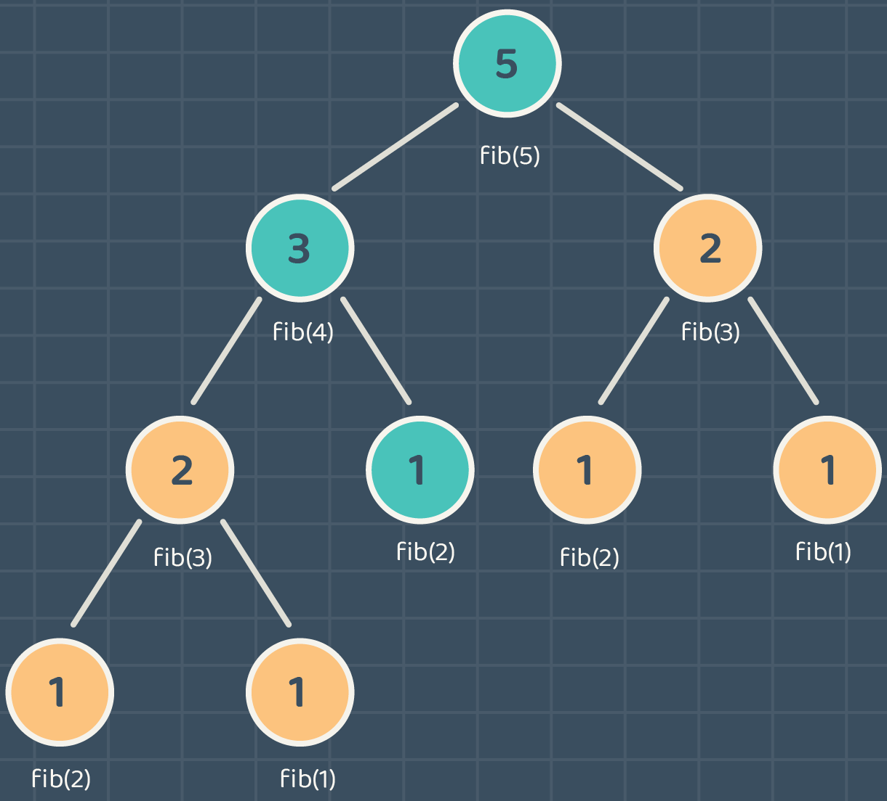

# Dynamic Programming
Dynamic programming is an algorithm technique that is used to solve problems. by breaking the problem into smaller subproblems then solve each subproblem once and store the solution to avoid redundancies, so we can have an `optimal solution`.

<p align="center" >

</p>

> * Why do we use dynamic programming? To optimize the time complexity of an algorithm from `O(2^n)` to `O(n)` or `O(n^2)`. 
> * By using dynamic programming we can find the number of ways to solve a problem and find an optimal solution to a problem. 


## Steps to Solve Dynamic Programming Problems
1. **Identify the subproblems**: Break down the problem into smaller subproblems.
2. **Solve each subproblem once and store the solution**: Use the `memoization` technique to store the solution of the subproblems to avoid redundancies.
3. **Solve the main problem**: Solve the main problem by using the solutions of the subproblems.

## Dynamic Programming Types:
1. **Top-down approach**(`memoization`): This approach involves solving the problem recursively and storing the subproblems' solutions to avoid redundancies.

2. **Bottom-up approach**(`tabulation`): This approach involves solving the problem iteratively and storing the subproblems' solutions to avoid redundancies.

## Example
Let's take an example of the Airline Ticket Price problem. airline companies often use dynamic pricing to adjust the price of tickets based on the demand and the time left before the flight. 

**First**: break down the problem into smaller subproblems: 

1. We have a list of flights with their prices.
2. We have a list of days left before the flight.
3. We have a list of the maximum number of tickets we can buy. 

**Second**: solve each subproblem once and store the solution to avoid redundancies.

**Third**: solve the main problem by using the solutions of the subproblems.


## Implementation 

Let's take the Fibonacci sequence to demonstrate the dynamic programming technique.

> * Fibonacci sequence is a series of numbers in which the next number is the sum of the two previous numbers subtracting the first number by -1 and the second number by -2, F n-1 + F n-2.
> * Fibonacci sequence are 1, 1, 2, 3, 5, 8, 13, 21, 34,... .
> * Example: The fibonacci sequence of 6 = 3 + 5 = 8.


Let's solve the Fibonacci sequence using recursion, and then we will optimize the solution using dynamic programming.
```java

class Main {
    public static void main(String[] args) {
       
      System.out.println(fibonacci(6));
    }
    
    public static int fibonacci(int number) {
        if(number <= 2) {
          return 1;
        } else {
          // Fibonacci formula  fib(n) = fib(n-1) + fib(n-2)
          return fibonacci(number - 1) + fibonacci(number - 2);
        }
      }
  }
```
Output: `8`

Although the output is correct, the time complexity of the algorithm is `O(2^n)` which is not optimal, if we want to calculate the Fibonacci sequence of 50, it will take a long time to get the result.

<p align="center" >

</p>

Notice that we have **redundancies** in the solution, for example, the Fibonacci sequence of 3 is calculated twice, and the Fibonacci sequence of 2 is calculated three times.

#### Dynamic programming has two techniques to solve the problem.

##### First technique is `top-down`(`memoization`) 

In this technique, we solve the problem `recursively` and store the solution of the subproblems in a `map`.

> map is a data structure that holds key-value pairs, the key is the Fibonacci number and the value is the result.

```java
import java.util.HashMap;
import java.util.Map;

class Main {
  // memo will hold the solution of the subproblems the key is the Fibonacci number and the value is the result.
  private static Map<Integer, Integer> memo = new HashMap<>();


    public static void main(String[] args) {
        System.out.println(fibonacci(6)); // Example usage
    }

    public static int fibonacci(int number) {
      // Check if the number is already solved
        if (memo.containsKey(number)) {
            return memo.get(number);
        }

        int result;
        if (number <= 2) {
            result = 1;
        } else {
            result = fibonacci(number - 1) + fibonacci(number - 2);
        }

        // Save the result in the memo
        memo.put(number, result);
        return result;
    }

}
```

##### Second technique is `Bottom-Up`(`Tabulation`) 

In this technique, we solve the problem `iteratively` and store the solution of the subproblems in an `array`.
```java
class Main {

    public static void main(String[] args) {
        System.out.println(fibonacci(6)); // Example usage
    }

    public static int fibonacci(int number) {
      if (number <= 2) {
          return 1;
      }
  
      // store the solution to the subproblem in an array
      int[] fib = new int[number + 1];
      fib[1] = fib[2] = 1;
  
      for (int i = 3; i <= number; i++) {
          fib[i] = fib[i - 1] + fib[i - 2];
      }
  
      return fib[number];
  }
}
```
Output: `8`


> * Remember to use the `memoization` technique to store the solution of the subproblems to avoid redundancies.
> * `memoization` is a Latin word that means "remembering".

## Projects
| Project Title | Deadline |
:-----------:|:-------------|
|[Dynamic Programming](https://github.com/SAFCSP-Team/DP-project/tree/main)|
